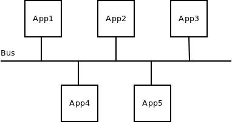
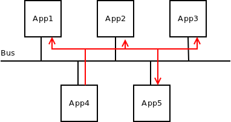
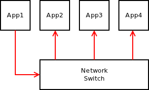
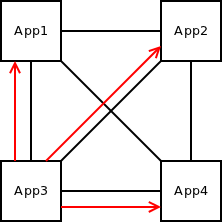
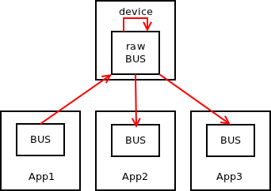
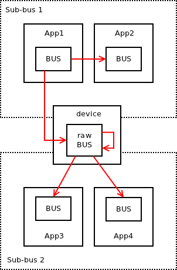

# Bus Messaging Pattern

The idea underlying "bus" messaging pattern is to provide the semantics similar to those of the hardware bus — everyone connected to the bus gets any data sent to the bus — just to do so on the higher layer. So, to use messaging terminology, everyone connected to the message bus gets any message sent to the bus.

This pattern doesn't scale well — at some point the number of applications connected to the bus will grow to the point where they will be overloaded by sheer amount of messages they produce. However, the pattern is widely used in some industries (stock trading) in IPC (messaging passing within a single machine) and local (broadcasting data on single LAN) environments. The assumption is that the bus topology is fully controlled by the admins and is never left to scale beyond the point where it breaks.

Given the wide usage of the pattern, new experimental bus protocol was added to [nanomsg](http://nanomsg.org) library. The protocol, due to its symmetrical nature, provides just one socket type named NN\_BUS. If the topology is set up right (there are paths between each two nodes in the topology) any message sent to NN\_BUS socket should be received by all the other NN\_BUS sockets in the topology, but not by the sender itself.

And a simple example of the usage of the bus socket:

    #include <nanomsg/nn.h>
    #include <nanomsg/bus.h>
    
    int main ()
    {
        int s = nn_socket (AF_SP, NN_BUS);
        nn_connect (s, "tcp://192.168.0.111:5555");
        nn_send (s, "ABC", 3, 0);
        nn_close (s);
        return 0;
    }

Note that as with any other broadcasting pattern, the message transfer is not reliable. If it was, single slow, dead or malevolent application would be able block the whole topology.

While the semantics of bus protocol are fairly simple, special care is needed to make it work for all possible configurations of the topology: multicast vs. unicast transports, broker-based vs. broker-less topologies, joining multiple partial buses using intermediate devices etc.

First, let's have a look at two trivial examples with no intermediate devices.

The multicast scenario is pretty straightforward:

The only special case to take into account is whether the underlying multicast transport delivers messages back to the sender. If so, the assumption that NN\_BUS socket doesn't receive messages that it itself had sent won't hold. So, it's important that implementation of such multicast transport filters out messages sent by itself. It should be relatively easy to do, for example, by filtering based on source IP address.

Another trivial setup is to connect any node with any other node in the topology by TCP connections. That of course means a lot of connections, but this kind of setup is sometimes used in small deployments (3-4 boxes):

This setup should just work with no special cases to take care of.

Now, let's have a look at some non-trivial topologies. The most common one is to have a broker (device) in the middle. Every application will connect to the device, which in turn will broadcast every message to every application except for the one that sent it.

To build a device, as is the case with any other scalability protocol, you need a special low-level or "raw" version of NN\_BUS socket.

    s = nn_socket (AF_SP_RAW, NN_BUS);

The semantics of such socket are following:

1.  When receiving a message, message is tagged by ID of the connection is was received on.
2.  When sending a message, it is sent to all the connections except for the one identified in the message tag.

I believe it's quite obvious how that works. One special aspect though is that due to fully symmetrical nature of bus protocol, intermediate devices — unlike devices for other scalability protocols — need just one socket, not two of them. Messages are simply received from the socket and sent back to it:

Finally, let's have a look how two partial buses can be joined into a single bus using an intermediate device. Note how raw bus socket semantics allow messages from one sub-bus to pass through the device to the other sub-bus, but prevent them to be republished to the original sub-bus:

The above is the first attempt to formalise bus pattern as a scalability protocol. The solution may still have its shortcomings. Any help with identifying the deficiencies of the protocol would be appreciated!

**February 19th, 2013**