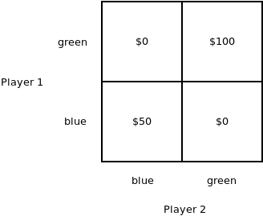
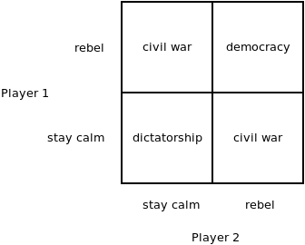
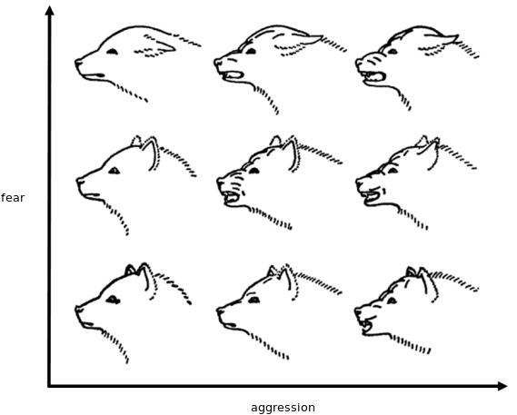
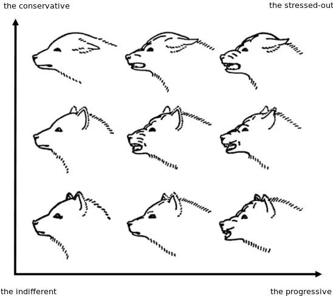

# Progressivism vs. Conservatism: A Game-theoretic Approach

Some time ago I've written a [blog post](http://250bpm.com/blog:118) about modeling tradition.

What I described, naively assuming it's something new, is an established concept of "[common knowledge](https://en.wikipedia.org/wiki/Common_knowledge_(logic))".

It turns out that among game theorists the concept was, well, a common knowledge.

The term was coined in 1969 by [David Lewis](https://en.wikipedia.org/wiki/David_Lewis_(philosopher)) and he've used it to explain convention. The idea was mathematicalized later by others. Check the [wikipedia article](https://en.wikipedia.org/wiki/Common_knowledge_(logic)) for details. Alternatively, here's a great [intro to the common knowledge concept](https://www.scottaaronson.com/blog/?p=2410) by Scott Aaronson. And here's a similarly themed [blog post](https://squid314.livejournal.com/2011/02/01/) by Scott Alexander.

Not sure what the takeaway is but maybe: When you are young drink less and read more game theory textbooks. That way you won't have to reinvent stuff later.

But now that I am done flaunting my ignorance, here's the interesting thing:

Both Scotts focused on the problem of getting into a better equilibrium. I, on the other hand, looked at how not to fail at the game entirely.

Consider a simple coordination game. The players don't know each other, can't communicate and so on. Each of them has to chose either blue card or green card. If they both pick green card, both get $100. If they both pick blue card both get $50. If they pick different cards they get nothing.

Assuming that the tradition is to pick blue card, the players are stuck in suboptimal equilibrium. They both get $50, sure, but if they both managed to pick green card they could get double. But you can't communicate and if you chose green and your partner sticks with the tradition of picking blue, then tough luck, you get nothing. Moreover, you'll get chastised afterwards for violating the tradition.

You can rephrase it in political terms. Replace $50 option by a shitty dictatorial regime. Replace $100 by a highly desirable functioning democracy. Replace $0 by a failed state (think of what's going on right now in Venezuela) or a civil war (Syria):

Scotts, based on how they've phrased the problem, were interested mostly in how to solve the coordination problem and move from $50 to $100 (or from a dictatorial regime to democracy).

I, on the other hand, have completely ignored the possibility of improving the outcome of the game and focused on how to not end up with $0 (or with a failed state, if you will).

Let's call the former approach "progressive" and the latter one "conservative".

Which gives an interesting perspective on things.

Think of how, at some point in your life, you become politically aware and you notice there are these two big factions in politics, "left" and "right", or "progressives" and "conservatives", respectively.

You try to make sense of it, but it turns out that if you avoid just blindly adopting one of the ideologies and you instead try to reason about it, it doesn't quite fit. Leftist politicians often adopt rightist policies. Rightist politicians often adopt leftist policies. One would like to associate "progressivism" with "liberalism" and "conservatism" with "authoritarianism", but that doesn't fit either. Just look at progressivist authoritarianism in Singapore or conservative liberalism in Switzerland.

In the end, I think, most intelligent people end up with this idea that both worldviews are just a random bunch of beliefs, traditions and stories assembled while sailing down the meandering river of history. That, to put it differently, your political party is your tribe — in very literal anthropological sense — and that it has no real philosophical underpinnings.

But notice how an uneasy belief is that to hold. It surely feels like there is some fundamental difference between progressive and conservative mindset. You try to ignore the feeling, to call it a feint played at you by your tribal brain. But every now and then you read about how researchers have performed twin studies and shown that political affiliation is heritable and then you can't avoid feeling uneasy about the entire thing.

But look at our coordination game! If we call anyone who, if placed at $50 square, starts thinking about how to get to $100 square a progressive and if we call anyone who immediately starts thinking about how not to get to $0 square a conservative, then we have a tidy game theoretic model of the phenomenon.

Let's do a sanity check first:

What does the model above predict about a typical progressive? Well, first of all, she's unhappy with the status quo. She doesn't want $50. She wants $100. She's willing to take risks. You can't make an omelette without breaking eggs after all. She's willing to start a French Revolution and she doesn't mind some head-chopping on the side.

What about a typical conservative? First of all he fears change. While he wholeheartedly agrees with the progressive that $100 is better than $50, he's risk-averse. A bird in the hand is worth two in the bush. Let's not risk what we already have for some rosy idealist fantasies. Hitler may not be an ideal leader but at least the trains run on time.

All right, that very much matches my stereotypes.

But can we get any interesting insights from the model?

Well, one such insight is that progressivism and conservatism are not the same thing (as in "it's all just tribal behavior"). They are not even mirror image of each another. They are genuinely different strategies to take when playing a coordination game.

By the way, that would also explain why the political affiliation may be heritable. I recall reading about scientists who were able to breed two breeds of mice. One was risk-insensitive, the other was extremely risk-averse. (TODO: Find the blue ethology textbook, look for the citation.)

It can also explain some policy preferences. Consider a progressive and a conservative discussing the problem of immigration. The progressive pulls our her charts and shows how immigration improves economic performance of the country. Then she points out how the immigrants actually commit less crime than the majority population. She goes on in that vein for a long time. But conservative doesn't care. From his perspective, immigrants are diluting the common knowledge. In the game of green and blue cards, they are random people who come in from the street and choose a random card, not even being aware that there's a carefully cultivated tradition of always choosing the blue one.

Or consider this: Why the conservative obsession with the church? Because church is viewed as an institution imposing particular Schelling point on the population. Free thinkers are dangerous because they are not guaranteed to converge on a unified common knowledge. There's no guarantee that, after they are done with their thinking, they'll chose the blue card like everybody else does.

Why the traditional family? Very much the same thing. Family imposes the common knowledge on the children. Same sex couple is likely to instill some unconventional ideas on the children. The kids will be spoiled! They may very well pick the green card once they grow up.

Another interesting insight from the model is that the two attitudes are not mutually exclusive. One can easily imagine being both unhappy enough with the current state of affairs to strongly desire change, but at the same time scared of change enough to strongly desire preserving the status quo. It wouldn't be logically consistent. But at the same time it would be very human.

And that reminds me of an illustration from Konrad Lorenz' book "Das sogenannte Böse" (clumsily translated to English as "On Aggression"):

The dog on the bottom left is relaxed, it feels neither aggression nor fear. The dog on the bottom right is aggressive, ready to attack. The dog on the top left is afraid. The dog on the top right is both afraid and aggressive. The latter may happen if the animal is cornered or if it can't to escape a dangerous situation for some other reason (e.g. defending the young).

Now, if we liken progressivism with aggression (in the good sense, as a will to achieve a desirable goal) and conservatism with fear (in the good sense, as a will to avoid harm) we can redraw the picture like this:

**April 21st, 2018**