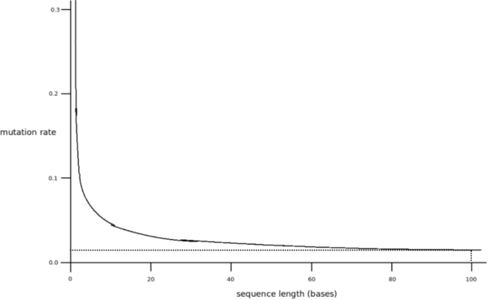

# Coordination Problems in Evolution: Eigen's Paradox

### Introduction

Lately I've written couple of posts that discuss coordination problems. Not the idealized, game-theoretical stuff but rather the real, messy coordination problems encountered by real people in the real world. Here, I will explore very different territory. I will look at coordination problems between between molecules, chromosomes, cells and individuals as they occurred and as they were solved in the course of biological evolution.

This article is based on the book "[The Major Transitions in Evolution](https://www.amazon.com/Major-Transitions-Evolution-Maynard-Smith/dp/019850294X)" by John Maynard Smith and Eörs Szathmáry.

Before proceeding I would like to say few words about why I chose that particular book, although it was published in 1995 and thus misses a lot of recent research.

**First**, it was written by widely recognized experts in the field. That may not have been that important if I was writing about a different topic, but evolutionary biology is notoriously tricky, subtle and prone to misunderstanding. Sometimes it generates crackpot ideas, which, nonetheless, sometimes [turn out to be true](https://en.wikipedia.org/wiki/Lynn_Margulis#Endosymbiosis_theory). A layman, or even a popular science writer, is likely to get lost.

[John Maynard Smith](https://en.wikipedia.org/wiki/John_Maynard_Smith) is one of the big names of evolutionary biology of 20th century. He owe to him the introduction of [game theory into evolutionary biology](https://en.wikipedia.org/wiki/Evolutionary_game_theory). He's the author of the central idea in the field, so called [evolutionarily stable strategy](https://en.wikipedia.org/wiki/Evolutionarily_stable_strategy), which is, to put it shortly, an application of the concept of [Nash equilibria](https://en.wikipedia.org/wiki/Nash_equilibrium) to biological, evolving systems.

[Eörs Szathmáry](https://en.wikipedia.org/wiki/E%C3%B6rs_Szathm%C3%A1ry) is less known, but he did a lot of work on the topic of origin of life.

**Second**, the book is concerned with the big changes in the evolutionary history. It doesn't spend much time on evolution-as-usual, on how a specific bone or organ evolved. Rather, it discusses the events which significantly changed the nature of evolution itself: How did the life began? How we've got the first self-replicating molecules? How did the cell originated? How did the multicellular organisms?

One would expect a book on such a grand subject to be a least a bit hand-wavy. Surprisingly though, it's not. Instead, the authors dive deep into the details of each individual topic, they discuss chemical details of the reactions in questions, their yield and speed, how would they survive in the competition of other reactions going on nearby and so on. They discuss the game-theoretic considerations of forming an eukaryotic cell or an insect society. They describe the minutiae of intragenomic conflict and the interplay between the development and evolution.

**Third**, in the introduction Smith and Szathmáry note that many (but not all) of the transitions they are going to discuss are, actually, solutions to coordination problems. They don't use that exact term, but it's pretty clear what they mean:

> One feature is common to many of the transitions: entities that were capable of independent replication before the transition can replicate only as part of a larger whole after it. … Given this common feature of the major transitions, there is a common question we can ask of them. Why did not natural selection, acting on entities at the lower level (replicating molecules, free-living prokaryotes, asexual protists, single cells, individual organisms), disrupt integration on the higher level (chromosomes, eukaryotic cells, sexual species, multicellular organisms, societies)?

In fact, thinking about coordination problems was what made them write the book in the first place:

> One of the stimuli for attempting the work was our realization that a model one of us had developed to analyze the origin of compartments containing populations of molecules was formally and mathematically similar to a model that the other had developed to analyze the evolution of cooperative behaviour in higher animals.

**Fourth**, the book strikes a good balance between targeting general public and targeting the experts only. It requires you to know your high school molecular and evolutionary biology, but not much more than that. You should be vaguely familiar with the concept of citric cycle, but nobody expects you to know what 1,3-biphosphoglycerate is. And once you know the basics, the book is surprisingly accessible and not hard to understand. (By the way, I see there's a [pop version](https://www.amazon.com/Origins-Life-Birth-Origin-Language/dp/019286209X) of the book published by the authors themselves. I haven't read it myself but it may be worth checking out.)

To sum it up, the book may be old, but it discusses exactly the topic I am interested in and it does so with great expertise and thoughtfulness. I don't think there's a newer book that does such a good job in this area.

And after all, my goal is not to summarize the cutting-edge biological research but to learn a lesson about the most general patterns of solving coordination problems. And those, I believe, haven't changed much in the past twenty years.

### Eigen's paradox

How did the first self-replicating molecules originate?

We know that with [RNA](https://en.wikipedia.org/wiki/RNA_world) and some similar molecules this process happens automatically: If there are basic blocks available in the environment, they will, thanks to their chemical properties, automatically attach themselves into appropriate places of an existing single-strand RNA and form a double stranded RNA. For replication to proceed, the two strands then have to be separated. It have been proposed that this may have happened in the vicinity of hydrothermal vents, where the molecule would experience both cool temperatures, conductive to attachment of nucleotides to the RNA and sudden hot temperatures which would separate the two strands.

Now, putting aside the specifics of RNA replication, how likely it is that such a self-replicating molecule will survive in the chaotic world?

[Manfred Eigen](https://en.wikipedia.org/wiki/Manfred_Eigen) observes that it depends on two factors: On the speed of replication and on its fidelity. Speed allows molecule to be replicated faster than it decays. Fidelity ensures that the result of replication is, in fact, the molecule we care about and not something else.

As for the fidelity factor, it depends on the RNA size. If chance of correct replication of a single base is, for example, 1/2, then chance of correct replication of 2-base RNA is 1/4, 3-base RNA 1/8 and so on.

Measurements show that the threshold for the RNA size is somewhere around 100 bases. If the molecule is larger than that it wouldn't be able to sustain itself. It would devolve into a mix of its broken copies. (For the exact maths check the [Wikipedia article](https://en.wikipedia.org/wiki/Error_threshold_(evolution)#Eigen's_Paradox).)

Following graph shows sustainable RNA size based on the mutation rate (1 - replication fidelity):

And here we encounter the paradox. If we wanted longer, self-sustainable RNA molecules we would need better fidelity. But better fidelity can only be achieved with the help of specialized enzymes. But the smallest genome able to code for such an enzyme, and for the necessary translating machinery, would require a number of bases greatly exceeding 100 nucleotides. It's a catch-22 situation.

Eigen speculates that the small molecules would have to somehow cooperate (Lo, a coordination problem!) to create a system capable of holding enough information to create more complex stuff. He proposes the "hypercycle" model.

Hypercycle is a set of RNA molecules that catalyze each other's replication. For example, if molecule A catalyses replication of molecule B, molecule B catalyses replication of molecule C and molecule C catalyses replication of molecule A, it's a hypercycle.

The point is that the catalysts can be specific. A should catalyze B and that's it. No need for complex machinery able to replicate any RNA sequence.

But before diving into the details: Could hypercycles even be established? Given the existence of small self-replicating RNA molecules, wouldn't the best replicator just crowd everyone else out and create a monoculture with no chance of forming a hypercycle?

Interestingly, no. And the reason is surprising. As RNA molecules replicate they have a tendency to pair with their own counterparts. (If fact, they bind so well that the problem is rather how the individual strands get separated after the replication.) And the bound double-stranded RNA cannot perform its catalytic functions. It inhibits its own creation.

In other words, the population of particular kind of molecule grows more slowly the more of its own kind is around. Its numbers do not double with each generation as one would naively expect. Yet, other kinds of molecules are not inhibited and can multiply at their own pace.

It can be shown that while in the world on exponentially replicating molecules the winner does take all, with sub-exponential growth, as described above, an equilibrium will form containing many different types of molecules.

Once we have the hypercycle in place it seems to work fine. Namely, notice how it is self-regulating in a way. If one link in the cycle is more efficient than other links it will soon run out of its catalyst and would have to wait for the rest of the cycle to catch up. Thus, a single component of the hypercycle cannot outcompete the rest of the cycle.

That being said, there's an obvious problem when we take mutations into account. If there is a mutation that makes one RNA molecule a less efficient catalyst for the next step of the cycle it could still reproduce at the same speed as the original molecule. That would mean lower concentration of the well-behaved molecule which would in turn suck the momentum out of the cycle. Many such free-riders and the concentration of cooperating RNAs would decrease to the level where the hypercycle would stop working at all.

So what can be done about the parasite molecules? An obvious solution would be to enclose the replicators in some kind of membrane. If the molecules in the compartment could replicate only together or not at all, the compartment containing parasites would simply "die" i.e. fail to replicate and be eventually outcompeted by the "healthy" compartments. (Emergence of membranes and the mechanism of the compartment fission is covered in the book but doesn't have much to do with the coordination problems, so I am going to hesitantly skip over it.) Alternatively, the evolution of the early life may have happened on a surface of a rock, thus limiting ways in which molecules can interact — this is so called "primordial pizza" model. Such anchoring of molecules to a flat surface may have had similar effect as enclosing them inside of a membrane.

Szathmáry and Demeter propose an alternative model called "stochastic corrector". The idea can be exemplified as follows.

Imagine a population of molecules consisting of "altruistic" molecules which catalyze replication and "parasites" which do not. Altruistic molecules reproduce less (it's hard to be both efficient catalyst and efficient replicator at the same time), the parasitic molecules reproduce more.

Let's assume that the molecules are either enclosed in compartments or tied to a surface in small patches. Each compartment or patch has to be small so that the law of big numbers doesn't kick in and make the proportion of the molecule types in all the compartments approximately the same.

The compartments with higher proportion of altruists are going to grow faster, the compartments with lower proportion of altruists are going to grow slower.

Then some external event, say a wave washing the molecules from the rock, mixes the molecules and creates a new arrangements of compartments or patches.

It can be shown that in such a setup there will arise a stable ratio of altruists and parasites. The parasites won't crowd out the altruists. To visualize the mechanism, imagine that every compartment contains only two RNA strands. The compartment containing two altruists will grow a lot. The compartment containing one altruist and one parasite will grow slower. Compartment with two parasites won't grow at all. After many iterations of mixing the molecules and repeating the process we'll arrive at a stable equilibrium of altruists and parasites.

Now think of compartments with three RNA strands. In that case it's more probable that any particular compartment will contain at least one parasite (7/8 as opposed to 3/4). The equilibrium will therefore contain more parasites than before. As we proceed to larger and larger compartments the relative advantage of parasites will grow until it reaches the point where the entire cycle will die off. It is therefore of essence that the compartment size remains small.

To sum it up, the stochastic corrector can work even without a hypercycle (there can be only one generalist catalyst molecule) but requires compartmentalization. Hypercycle, on the other hand, doesn't require compartments but is vulnerable to parasites. One can imagine a history where replication started with hypercycles and then, after membranes were formed, continued as a stochastic corrector.

The models above are, obviously, just a speculation. We don't have any remnants of those early stages of life and so guessing is the best we can do. Yet, some generic patterns, more examples of which we are going to encounter later, are beginning to emerge.

### Chromosomes

At some later point in the evolution the stand-alone genes stopped competing for themselves and started cooperating by getting linked into chromosomes.

Why would that be? Why link one's fate to other's rather than just keeping the status quo?

Apparently, linking into chromosomes comes with disadvantages for individual genes. Copying of the long linked RNA strands is slower. The conservative estimate of replication rate slow-down is 50%. That would make the linked gene severely disadvantaged in the competition with its stand-alone cousin. There has to be something that counterbalances that handicap.

The authors suggest that the main reason for this is what happens during the cell division.

If the daughter cell needs to contain all the genes to survive, it's crucial for any gene to end up in a cell that does contain at least one copy of each gene. Otherwise, no matter how successful they are individually, how many copies of themselves are present, they will end up in a dead end, trapped inside a non-functional cell.

This is especially true if the mechanism of the division is rather unsophisticated and probabilistic like, say, simple folding of the membrane and eventual random splitting of the content of the cell.

Furthermore, the more genes there are the more likely it is that one of them will be missing in the daughter cell. It may even happen that both daughter cells will miss a gene and die. This, I guess, places a hard upper limit on the number of stand-alone genes in the cell. With all genes linked in a single chromosome, on the other hand, it is much easier to succeed. The worst, though improbable, thing that can happen is that one of the daughter cells will end up with no genes at all.

### To be continued

In the [following parts](http://250bpm.com/blog:136) of this article I would like to cover topics such as emergence of the eukaryotic cell, origin of mutli-celular life, of sex and of animal societies. In the end I am going to speculate about the very high-level, generic cooperation patterns and whether they have any semblance to coordination patterns that we encounter in human society.

**October 12th, 2018**
