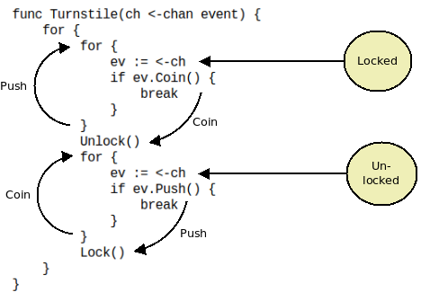

# Equivalence of State Machines and Coroutines

In the past I often referred to the equivalence between state machines and coroutines as a kind of obvious fact that doesn't need any additional explanation. It was brought to my attention, however, that that may not always be the case.

This article therefore doesn't attempt to express and deep and ground-breaking truth, rather, it illustrates the equivalence of state machines and coroutines using a practical example.

The example is stolen from [Wikipedia's article on finite state machines](https://en.wikipedia.org/wiki/Finite-state_machine):

> A turnstile, used to control access to subways and amusement park rides, is a gate with three rotating arms at waist height, one across the entryway. Initially the arms are locked, blocking the entry, preventing patrons from passing through. Depositing a coin or token in a slot on the turnstile unlocks the arms, allowing a single customer to push through. After the customer passes through, the arms are locked again until another coin is inserted.

Wikipedia presents the state machine in question in the following manner:

And here's my attempt to rewrite the state machine as a coroutine in Go:

**December 15th, 2018**
