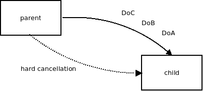
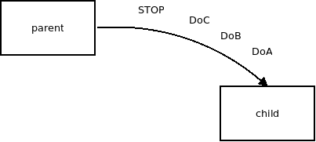

# Graceful Shutdown

**WARNING**: The claims about composability of the graceful shudown construct have been defeated in the discussion [here](https://trio.discourse.group/t/graceful-shutdown/93). Or maybe not. Judge for yourself. However, most of the analysis in this article is still relevant.

### Introduction

Within a structured concurrency world, graceful shutdown is a little understood, little addressed and confusing topic.

I've been fighting with it myself for almost a year (longer than with any other problem I can recall) and it haven't been a pleasant experience. If felt like running in circles. Too many contradictory requirements, to much complexity and too often a solution I've came up with turned out to be one of the solution I've already rejected in disguise.

Nathaniel Smith on [structured concurrency forum](https://trio.discourse.group/c/structured-concurrency) helpfully pointed me to the [discussion about graceful shutdowns in Trio](https://github.com/python-trio/trio/issues/147) and oh boy, does that discussion sound familiar.

Anyway, finally I've came up with a solution that's simple and works for all use cases. But it turns out it's one of those ideas that seem not to make sense until something clicks in one's mind. From there on though, they seem perfectly obvious, up to the point where one wonders how the others can possibly not get it.

In this post I'll try to explain.

### The use case

The classic use case for graceful shutdown is a web server. It's handling many connections from the clients. When it's being shut down, you want it to happen in a controlled manner so that clients don't end up with half-loaded pages and such. Specifically, you want to stop the accept loop to make sure that no new connections are being made. Then you want to wait for say 10 seconds to give existing connections time to finish their work. Finally, when the time is up, you want to cancel any remaining connections and exit the process.

Of course, the nature of the workload may vary. Web server needs to shut down connections. CRUD application needs to shut down its connection to database. Yet different application may want to save data to disk before exiting.

### What's graceful shutdown, anyway?

Graceful shutdown intuitively seems to be some kind of cancellation. Here, I would like to compare it to the classic hard cancellation and argue that graceful shutdown isn't anything like it.

Let's have a look at hard coroutine cancellation first. The code of the coroutine looks like this:

    rc = send(s, "Hello!");
    if(rc == ECANCELED) return;
    rc = recv(s, &msg);
    if(rc == ECANCELED) return;
    rc = sleep(60);
    if(rc == ECANCELED) return;

When parent coroutine hard-cancels a child coroutine, a blocking call within the coroutine will immediately return an error (or, in high-level languages, it will throw an exception) and the coroutine will exit.

Think of hard cancellation as "asking the coroutine to return immediately". In reality, it may do some bookkeeping tasks before exiting (freeing the allocated memory etc.) but form the perspective of this article, thinking of hard cancellation as eliciting immediate "return" in the coroutine is a pretty good approximation.

Now have a look at graceful shutdown.

It's very different. By saying "shut down gracefully" we are asking the coroutine to finish whatever it was doing and start doing different kind of work, namely it's shutdown business logic. So, for example, while during its normal lifetime it may be receiving data from the network and writing them to the database, after graceful shutdown request it may want to exchange terminal handshakes with the network peers and start flushing any in-memory data to the database.

Not only is graceful shutdown not immediate. It can be arbitrarily long or even infinite. Consider the case when you are trying to exchange a terminal handshake with a network peer. If the peer is not responding, the graceful shutdown will never finish.

### More on the nature of graceful shutdown: In-band vs. out of band

Consider a case where the parent coroutine sends the child coroutine a stream of tasks to process. It does so via a channel. It may send DoA, DoB and DoC requests. Then it hard-cancels the child. Hard cancellation is supposed to be immediate and so the child coroutine exits even though DoA, DoB and DoC haven't been processed yet.

Does the graceful shutdown work is a similar way? No. Graceful shutdown means "finish whatever you are doing but take your time and be careful; don't break the business logic". During graceful shutdown you definitely don't want to drop the requests on the floor. So, instead of sending an out-of-band signal, like hard cancel did, you just write an application-defined STOP message to the channel and leave the child coroutine to do it's work. After it processes DoA, DoB and DoC, it will eventually receive the STOP message. At that point it will do the terminal handshakes, it will flush data to disk and so on. Finally, it will exit.

The point I am trying to make here is that while hard-cancel signal travels necessarily out-of-band, the graceful shutdown signal must be, equally necessarily, passed in-band.

And when you think about it a little bit more, "out-of-band" means that the communication channel is created and managed, invisibly to the user, by the language runtime (or a structured concurrency library, such as Trio or libdill) while "in-band" means that the communication channel is business-logic-specific and that it is defined and managed by the application itself.

In consequence, language runtime (or the library) has no way of knowing how to send a graceful shutdown to the child coroutine, even if it wanted to. The coroutine is listening on an application-specific channel. It may be channel A or channel B. It may be listening on both. Or maybe it's listening on channel A up to some point in its lifecycle and then starts listening on channel B. Or maybe it even gets the graceful shutdown request over the network (the latter is common during terminal handshake in network protocols). The language runtime just doesn't know.

Ergo, sending a graceful shutdown request cannot possibly be a feature of the language. It must be done manually by the application.

### Even more on the nature of graceful shutdown: Cancellation points

The rules of hard cancellation are strict: Once a coroutine has been hard-canceled the very next blocking call will immediately return ECANCELED. In other words, every single blocking call is a cancellation point.

Graceful shutdown is different. It allows the coroutine to exit only at special points in the workflow where the business logic is in consistent state.

Consider the case of an RPC server. It reads a message from the peer, does some computation, then sends a reply to the peer.

Graceful shutdown can terminate the coroutine only when it is idling and waiting for a new request.

It we allowed graceful shutdown to terminate the coroutine while it is trying to send the reply, it would mean that a request could go unanswered. And that doesn't deserve to be called "graceful shutdown".

### Let's summarize

What we learned so far is that hard cancellation:

1.  Is triggered via an invisible communication channel created by the language runtime.
2.  It manifests itself inside the target coroutine as an error code (ECANCELED in libdill) or an exception (Cancelled in Trio).
3.  The error (or the exception) can be returned from any blocking call.
4.  In response to it, the coroutine is not expected to do any application-specific work. It should just exit.

Graceful shutdown, on the other hand:

1.  Is triggered via an application-specific channel.
2.  Manifests itself inside the target coroutine as a plain old message.
3.  The message may only be received at specific, application-defined points in the coroutine.
4.  In response to it, the coroutine can do arbitrary amount of application-specific work.

Well, that seems to be it.

Hard cancellation is fully managed by the language. Graceful shutdown is fully managed by the application. From the language designer's perspective there's nothing to see here. We should just move on and forget about the entire business.

Or should we?

### Keeping graceful shutdown in check

Well, it turns out that the parent coroutine often doesn't want graceful shutdown to take forever. It's willing to give it ten seconds to finish, but if that doesn't happen, so be it, c'est la vie, it will just hard-cancel it.

    void main() {
        ch = channel();
        b = bundle(); // a.k.a. scope or nursery
        bundle_go(b, worker(ch));
        ...
        send(ch, STOP); // ask the child to shut down gracefully
        sleep(10);
        bundle_cancel(b); // hard-cancel the child if it haven't finished yet 
    }

You may see the problem with this code. It works OK, but it always waits for 10 seconds, even when the child exits immediately. And that sounds like a waste.

So, after all, the language can do something to help with the graceful termination. It can provide a primitive to avoid the ugly non-negotiable sleep() step.

### The proposal

First, let me be clear. I don't propose to add any new concept to the existing structured concurrency model. Not even the concept of "graceful shutdown". We'll do with the existing concepts of coroutine, bundle (scope, nursery) and plain old hard cancellation.

Second, I propose to add a timeout parameter to the traditional bundle\_cancel() method:

    bundle_cancel(b, 10);

The semantics are as follows: The function will wait for 10 seconds for all coroutines in the bundle to finish. If they all do before the timeout expires, the function will exit immediately as the last coroutine finishes. If they don't, it will hard-cancel all the remaining coroutines when the time is up.

In either case, when the function exits there are no more coroutines running in the bundle. If fact, the bundle itself doesn't exist any more.

The function also happens to be a blocking function and thus it behaves as any other blocking function. When the parent coroutine itself is hard-canceled bundle\_cancel() hard-cancels all the coroutines in the bundle and returns ECANCELED error to the caller.

NOTE: With timeout set to zero, this is equivalent to the plain old hard cancellation. This has some pretty obvious implications for backward compatibility.

### The examples

I am aware that such a trivial construct doesn't look like it's up to the task of dealing with the hydra of graceful shutdown.

So, to convince you, let us look how it fares in the wild.

##### The trivial case

In this scenario the child coroutine does some work and exits.

    coroutine void worker(socket_t s) {
        int rc = send(s, "Hello, world!");
        if(rc == ECANCELED) return;
        message_t msg;
        rc = recv(s, &msg);
        if(rc == ECANCELED) return;
        return;
    }
    
    int main(void) {
        socket_t s = create_connected_socket();
        bundle_t b = bundle();
        bundle_go(b, worker(s));
        sleep(60);
        bundle_cancel(b, 10);
        return 0;
    }

Note how the worker coroutine knows nothing about graceful shutdown. It looks exactly the same way as it would if there was only hard cancellation. Yet the parent coroutine still manages to shut it down gracefully!

If the worker manages to finish its work in 10 seconds, the program will exit immediately. If it doesn't manage to finish in time, say if it is stuck in the recv() call, it will get hard-canceled after 10 seconds and the program will exit.

##### Infinite loop

This example deals with the question of what happens if the child coroutine never finishes.

    coroutine void worker(socket_t s) {
        while(1) {
            int rc = send(s, "Hello, world!");
            if(rc == ECANCELED) return;
            message_t msg;
            rc = recv(s, &msg);
            if(rc == ECANCELED) return;
        }
    }
    
    int main(void) {
        socket_t s = create_connected_socket();
        bundle_t b = bundle();
        bundle_go(b, worker(s));
        sleep(60);
        bundle_cancel(b, 10);
        return 0;
    }

The code is identical to the previous example, except for the forever loop that was added to the worker. And once again, the child doesn't do anything specific to enable graceful shutdown.

You may feel like this example is a bit pointless. The worker coroutine runs at full speed throughout the entire grace period and then it gets hard-cancelled. It's hardly the graceful shutdown of your dreams.

But while that may be true, I am trying to make a point here. And the point is: The parent doesn't have to care.

The parent doesn't have to care whether the coroutine supports a graceful shutdown or not. It doesn't have to worry about how long the shutdown would take. It doesn't have to care whether there are infinite loops or not. It doesn't care if the worker behaves in a pointless way as shown in the example above.

The programmer doesn't have to go and inspect all the coroutines he is using to find out how the graceful shutdown would behave.

He just calls bundle\_close(b, 10) and he is guaranteed that the coroutine will be dead in at most 10 seconds.

##### Graceful shutdown-aware coroutine

As already mentioned, the language has no concept of graceful shutdown.

Therefore, the parent coroutine has to send the graceful shutdown signal to the worker coroutine manually. It does so via a channel.

    coroutine void worker(socket_t s, channel_t ch) {
        while(1) {
            message_t msg;
            int rc = recv_from_socket_or_channel(s, ch, &msg);
            if(rc == ECANCELED) return;
            if(rc == FROM_CHANNEL) goto graceful_shutdown;
            if(rc == FROM_SOCKET) {
                // process msg here
            }
            rc = send(s, "Hello, world!");
            if(rc == ECANCELED) return;
        }
    graceful_shutdown:
        ... // do the entire graceful shutdown thing here
    }
    
    int main(void) {
        socket_t s = create_connected_socket();
        channel_t ch = channel();
        bundle_t b = bundle();
        bundle_go(b, worker(s, ch));
        sleep(60);
        send(ch, "STOP"); // ask for graceful shutdown
        bundle_cancel(b, 10); // give it at most 10 seconds to finish
        return 0;
    }

You may have noticed that I've been cheating here. recv\_from\_socket\_or\_channel() function hides a lot of complexity and to be fair, I am not aware of a language that has good API for this kind of thing. However, it is unrelated to the topic of graceful shutdown, so I'll let it be for now.

That being said, what I wanted to show here is how the cancellation points for graceful shutdown checkpoints are application-defined. In particular there's only one place in the workflow where STOP message can be received.

The application is basically an RPC server, waiting for a message from a client and then sending a "Hello, world!" reply. And we certainly don't want the client to miss their hello world message! Therefore, the only valid point to deal with the graceful shutdown is when the coroutine is idling, waiting for a new request.

If we checked for STOP before the send call, the coroutine would exit and RPC would end up unanswered. It would a large stretch to call that "graceful shutdown".

##### Graceful shutdown triggered by a network peer

I've already mentioned that it's entirely up to the application to decide how the graceful shutdown signal is delivered to the coroutine. One specific case of this is when the signal comes from the outside.

It's a common scenario with network protocols. Each peer can ask for the connection to be shut down. For example, with WebSockets, each party can send a special [CLOSE message](https://tools.ietf.org/html/rfc6455#section-1.4) to inform the peer they want to shut down. The peer should respond by sending CLOSE message of its own.

The following code is a server that responds to CLOSE message from the client.

    coroutine void worker(socket_t s) {
        while(1) {
            message_t msg;
            int rc = recv(s, &msg);
            if(rc == ECANCELED) return;
            if(msg == "CLOSE") break;
            rc = send(s, "Hello, world!");
            if(rc == ECANCELED) return;
        }
        int rc = send(s, "CLOSE");
        if(rc == ECANCELED) return;
        return;
    }
    
    int main(void) {
        socket_t s = create_connected_socket();
        bundle_t b = bundle();
        bundle_go(b, worker(s));
        sleep(60);
        bundle_cancel(b, 10);
        return 0;
    }

Note how this interacts with the server-initiated graceful shutdown. The worker coroutine replies to CLOSE messages in a straightforward way. On the other hand, when the server is being shut down it stops accepting new connection (left as an exercise for the reader) and gives existing connections 10 seconds to exit. If they don't they'll get hard-canceled.

There's a missing piece of course. When server initiates the graceful shutdown, the worker should send unsolicited CLOSE message to the client to inform it that it wants to shut down the connection and then it should wait for CLOSE in reply.

So here's the full implementation:

    coroutine void worker(socket_t s, channel_t ch) {
        while(1) {
            message_t msg;
            int rc = recv_from_socket_or_channel(s, ch, &msg);
            if(rc == ECANCELED) return;
            if(rc == FROM_CHANNEL) goto server_initiated_shutdown;
            if(rc == FROM_SOCKET) {
                if(msg == "CLOSE") goto peer_initiated_shutdown;
            }
            rc = send(s, "Hello, world!");
            if(rc == ECANCELED) return;
        }
    server_initiated_shutdown:
        int rc = send(s, "CLOSE");
        if(rc == ECANCELED) return;
        // drop all incoming messages until CLOSE is encountered
        while(1) {
             message_t msg;
             rc = recv(s, &msg);
             if(rc == ECANCELED) return;
             if(msg == "CLOSE") break;
        }
        return;
    peer_initiated_shutdown:
        int rc = send(s, "CLOSE");
        if(rc == ECANCELED) return;
        return;
    }
    
    int main(void) {
        socket_t s = create_connected_socket();
        channel_t ch = channel();
        bundle_t b = bundle();
        bundle_go(b, worker(s, ch));
        sleep(60);
        send(ch, "STOP"); // ask for graceful shutdown
        bundle_cancel(b, 10); // give it at most 10 seconds to finish
        return 0;
    }

### Graceful shutdown is composable

Now that we are done with examples, let's look at the thing from a conceptual point of view.

I've already mentioned that parent coroutine doesn't care about specifics of the shutdown mechanism of the child coroutine. It doesn't care if the child has infinite loops, it doesn't care whether it has application-level support for graceful shutdown and so on.

But there's one more thing it doesn't care about. Guess what. It doesn't care if the child has children of its own.

It also doesn't care whether it is already in the process of graceful shutdown, initiated, for example, by a remote peer, by an internal failure or maybe by some kind of coroutine-wide timeout.

This enforces strict isolation between coroutines and makes the graceful shutdown composable.

Let's illustrate the point on a concrete example:

    coroutine void nested_worker(message_t msg) {
        // process the message here
    }
    
    coroutine void worker(socket_t s, channel_t ch) {
        bundle_t b = bundle();
        while(1) {
            message_t msg;
            int rc = recv_from_socket_or_channel(s, ch, &msg);
            if(rc == ECANCELED) goto hard_cancellation;
            if(rc == FROM_CHANNEL) goto graceful_shutdown;
            if(rc == FROM_SOCKET) {
                bundle_go(b, nested_worker(msg));
            }
            rc = send(s, "Hello, world!");
            if(rc == ECANCELED) goto hard_cancellation;
        }
    graceful_shutdown:
        rc = bundle_cancel(b, 20); // cancel the nested workers with 20 second grace period
        if(rc == ECANCELED) return;
        return;
    hard_cancellation:
        rc = bundle_cancel(b, 0); // cancel the nested worker immediately
        if(rc == ECANCELED) return;
        return;
    }
    
    int main(void) {
        socket_t s = create_connected_socket();
        channel_t ch = channel();
        bundle_t b = bundle();
        bundle_go(b, worker(s, ch));
        sleep(60);
        send(ch, "STOP"); // ask for graceful shutdown
        bundle_cancel(b, 10); // give it at most 10 seconds to finish
        return 0;
    }

Note that when the server is being shut down it allows only for 10 second grace period. However, worker(), when being gracefully shut down gives its children 20 second grace period. That sounds like it's going to be a headache, but it turns out it is not.

When the 10 second grace period granted by the main() function expires it hard-cancels the worker(). The worker may be still waiting for its children to finish. But we don't care. Hard-cancelling the worker() means that "bundle\_cancel(b, 20)" will immediately hard-cancel all the nested workers and exit with ECANCELED error (double-check the semantics of bundle\_cancel() as proposed above).

All in all, we get the intuitive behaviour: The server shuts down in 10 seconds and hard-cancels all the children and grand-children that were still running at the time.

### Implications for higher level languages

It's obvious that in higher level languages a lot of the boilerplate code can be avoided. For example, with "Canceled" exception all the "if(rc == ECANCELED) return;" lines just go away.

However, how to wrap the entire thing into a higher-level level constructs, such as automatic scopes, is a probem yet to be solved.

**Feb 16th, 2019**
