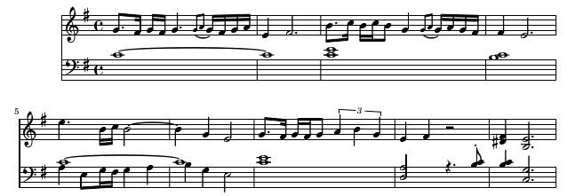

# Lydian song

Now, I know that this is super-weird and probably makes sense to nobody by myself.

First, it's in lydian scale which is nowadays used nowhere but in some Slovak (and, allegedly, also in Polish) folk songs.

Second, the base chord is dissonant (C maj).

It's meant to be played by strings so that dissonances do not fade out.

Use as you see fit.

**Feb 25th, 2019**
