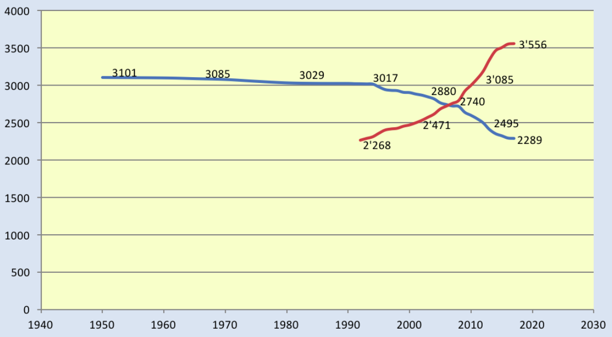

# Swiss Political System: More than You ever Wanted to Know (II.)

[Previous part](http://250bpm.com/blog:161)

In the previous part of this article we've looked in detail at the Swiss system of direct democracy.

It's hard not to conclude that direct democracy is the reason why Swiss society works so well. However, one then remembers the direct democracy in California and is no longer so sure. Not that the Californian direct democracy is necessarily bad, but it shows no spectacular results either.

One possible argument to explain the discrepancy could be that direct democracy needs time to mature. Which it certainly does. We've already seen how the Swiss popular initiative needed hundred years to evolve to its current form. However, Swiss direct democracy dates back to the end of 19th century, while Californian direct democracy became fully established in 1911. Difference of mere 22 years.

Another possible explanation of why Swiss direct democracy works better is that California is constrained by being part of the United States. And there is no direct democracy on the federal level in the US. Maybe the dysfunction trickles down from above and the local direct democratic institutions are not able to cope with it.

I have no idea whether that's a plausible explanation, however, we may be wiser after giving a closer look to the second pillar of the Swiss political system, the feature that is often called "federalism" but which can, in my opinion, be interpreted in much wider sense as decentralization at all levels of the society.

### Cantons

Switzerland has once been [a loose confederacy of independent states](https://en.wikipedia.org/wiki/Old_Swiss_Confederacy) and the unification in 1848, to a significant extent, preserved that independence.

While there is a central government, its powers are rather limited. So-called "principle of subsidiarity" applies: The areas managed by the federal government are explicitly listed in the constitution and anything that is not included in the list automatically falls under the jurisdiction of the cantons. Even in the areas that the federal government is responsible for, it often does the decision making, but leaves the execution to the cantons. So, for example, although the Department of Justice and Police exists at the federal level, the police forces themselves operate at the cantonal level, in larger cities even at the municipal level.

Each canton is a small state on its own. It has its own constitution, its own parliament and its own government.

Even the political system varies among the cantons. Most cantons hold cantonal elections every four years, but the canton of Appenzell Innerrhoden holds them every year. Yet other cantons elect their parliaments every five years. Most cantons use majority system in cantonal elections. However, canton Ticino uses proportional system. In canton Bern, one seat in the cantonal government is reserved for a representative of the French-speaking minority in Bernese Jura. In the canton of Glarus, the voting age was lowered a few years ago and therefore, unlike in the rest of Switzerland, young people can vote from the age of sixteen.

The cantons can negotiate directly with each other and adopt mutual treaties (the so-called "concordats") thus bypassing the federal government. Powerful intercantonal organizations exist: The Conference of Cantonal Governments, the Conference of Cantonal Ministers of Finance, the Conference of Cantonal Ministers of Education and so on.

While these parallel structures make it possible to keep the central government lean, some argue that they are lacking the full democratic accountability. As far as I can say, it doesn't look that bad though. When German-speaking cantons were trying to harmonize their school curricula, the measure was voted on in cantonal referenda in all the affected cantons rather than having it forced on them by the conference of education ministers.

Sometimes it happens that the cantons are unable to agree on a question. One such question was whether the school year should begin in spring or in autumn. That was, understandably, a serious problem for the families moving between the cantons. The issue was resolved in 1985 in a federal referendum (58.8% in favor of autumn). The decision was written into the federal constitution and Switzerland took a small step towards centralization.

### Municipalities

The power sharing between cantons and municipalities is governed by the cantonal constitution and thus varies among the cantons. German-speaking cantons tend to apply the subsidiarity principle. Everything that is not explicitly delegated to the canton is governed on the local level. Canton of Graubünden goes the furthest. It used to be, historically, a federation of municipalities, or rather, a union of three federations, called - the Game of Thrones fans are going to appreciate it - The Grey League, The League of Ten Bailiwicks and The League of God's House. (And it gets stranger. What is now the canton of Wallis was once called the Republic of the Seven Tenths.) In any case, in Graubünden the villages have their own constitutions and so on. The French-speaking cantons, on the other hand, are less fond of passing power to the lower levels. The municipalities, for instance, often have no say it their political system, which is, instead, imposed on them by the cantonal constitution.

Either way, municipalities are relatively separate units and there is a strong pressure on them to remain so. This is evidenced, for example, by the fact that all attempts to unify the tax system, whether within a single canton or nationwide, have been rejected in referenda.

Municipalities can enter into mutual agreements (e.g. regarding the joint supply of water), but, interestingly, they cannot negotiate directly with the federal government. The federal government, in turn, has no direct relationship with the municipalities. It must always act through the canton.

An unusual detail is that municipalities are in charge of granting citizenship. Swiss citizenship is acquired by citizens of the individual cantons and cantonal citizenship is acquired by citizens of individual municipalities. The process therefore bubbles up in the bottom-up way.

To understand the split of powers and responsibilities between the federation, the cantons and the municipalities, let's have a look at how are individual sectors financed.

Municipalities spend the most on the cost item "environment" (63%). Environment is followed by "culture, sports and recreation" (56%) and "administration” (44%).

By comparison, the cantons contribute the most to the items "public order" (67%), "health" (56%) and "education" (53%).

Federal government, in turn, spends the most in the area of "foreign relations" (100%), "defense" (90%), "economy" (52%), "transport" (51%) and "finance" (51%).

Similarly, taxes are collected on federal, cantonal and local level. Each level determines the tax rate on its own. The ratio between the three of them tends to be around 1:1:1.

All taxes are collected at the municipal level (although sometimes the municipality can delegate the task, for a fee, to the canton). The municipalities then send the corresponding portion of the taxes to the cantons and these in turn to the federal authorities. The other way round, the central government sends, within the framework of equalization programs, part of the money back to the cantons. The equalization is relatively moderate though and makes up at most 15% of the cantonal income.

Since cantonal and local taxes can account for up to huge chunk of overall taxes, rich people are incentivized to move to tax haven cantons, such as Zug or the predominantly rural canton of Schwyz. This begs a question whether there is a tax race to zero among the cantons and municipalities. The data seems to indicate that indeed, the taxes tend to slowly decrease. But, on the other hand, the public sector doesn't seem to be underfinanced at the present moment.

### Associations

Below the municipal level, there are associations of different kinds: Church communities, professional organizations, guilds, clubs for keeping public spaces clean, sport clubs, shooting clubs, gardening clubs, cultural associations, parents' associations, charities, choirs and so on.

Switzerland is home to around 90,000 associations and most Swiss are members of at least one association.

Depending on where you come from, you may feel that putting associations on the ladder of decentralization is strange. Governance, in the end, is something essentially different from hobbyism. In many countries the split between the official (mandatory, political) and the non-official (voluntary, for fun) is quite palpable. But in Switzerland the boundary is quite blurry.

Military service, for example, is mandatory and once a person completes basic training, they get a gun. From that point on, they are required to practice shooting at least once a year. Given that the shooting is mandatory, one would expected it to be organized by the state. In reality, however, it's the local shooting clubs who take care of the task. In other words, the state relies on voluntary associations to perform some of its critical tasks.

Or have a look at so called "[citizens' municipalities](https://en.wikipedia.org/wiki/B%C3%BCrgergemeinde)". These are associations that own the the municipal land, public buildings, forests and mountain pastures. Citizens’ municipality Bern even owns a bank. The "citizenship" in these municipalities is hereditary and distinct from the citizenship in the "political municipalities" familiar from elsewhere. Citizens' municipality collects rent from its possessions and spends it on causes beneficial to the municipality. You are left to wonder whether these are state or private organizations.

### Militia System

Another mechanism that blurs the border between the state and the citizens is the so-called "[Militia system](https://de.wikipedia.org/wiki/Milizsystem_(Schweiz))". It is a principle according to which the civil service is voluntary and performed in one's free time, with no or little compensation.

From that point of view, there's no much difference between being a treasurer of the municipality and being a treasurer of the local yodeling club. Also, both state and non-state organizations are under public scrutiny. Non-functional minicipality requires fixing as much a non-functional rowing club.

Militia system deserves a few comments.

While it is based on the age-old concept of "citizen and soldier" and, indeed, every Swiss male is obliged to do military service, it extends to other spheres of public life. Citizens can be asked, for example, to do service in a local fire brigade. This is generally frowned upon and volunteers are preferred. Nevertheless, the option exists. Voluntary service in school boards, churches and in municipal, cantonal or federal administration is also considered to be a part of the militia system.

In the latter case, the militia system is meant to bring real world, practical experience to the government. The idea is that a baker can represent other bakers in parliament, whether federal or cantonal, better than a professional politician.

However, the militia system seems to be gradually breaking down. Only a third of members of the federal parliament are still doing it as a side job. Also, with the increased mobility, the feeling of belonging to a particular place and the prestige associated with working for a municipal authority wears down. Large municipalities tend to hire salaried employees. Small municipalities, on the other hand, are struggling to fill in the administrative positions. This is one of the reasons behind the increasing number of municipality mergers in the past few decades.

Blue: Overall number of municipalities in Switzerland. Red: Average number of inhabitants per municipality. Author: Seadart <a href="https://creativecommons.org/licenses/by-sa/3.0">CC BY-SA 3.0</a>

If you put your conservative hat on, this development is deeply troubling. Maybe even more troubling than the current bogeyman of the progressives, the rise of right-wing populism. Because what it means, on the big scale, is replacement of the state run by citizens by the state run by the political class. In other words, the replacement of participative democracy by a spectator democracy. On the local scale, on the other hand, with at best as many candidates as there are positions the election turns from choosing the best candidate into approving the single running one. And it is not clear, whether the unique Swiss model of direct democracy and rule by consensus can survive that.

There is no easy way out. Even making the administrative service compulsory may not be sufficient. Some cantons do have such a provision in their constitutions, inherited from the times past. But now, that they actually put it in use, it turns out that the enforcement is hard. Couple of years ago, for example, a small village in the canton of Uri has elected a new municipal council. Out of five members, three were elected against their will. To avoid the service, all three have relocated, leaving the council without quorum and therefore non-functional.

### Apartment blocks

At the very bottom, at the bottom of the decentralization ladder, there are the politics of apartment blocks. These are things like parking (Your car is not parked in parallel!), noise (The neighbor is playing trumpet at 10pm! And he's butchering the song!) and similar.

This is often very informal and varies from one apartment block to another. I can't speak for everybody, but let me quickly summarize my own experiences as well as the anecdotes I've heard from others.

For me, personally, the most palpable demonstration of apartment block politics is the shared laundry room, which is very common in Switzerland. It is a direct attack on the modern custom of people living side by side without knowing each other or solving common problems.

The shared laundry room was, for example, what led to my very first contact with my neighbors. The very first week, a neighbor complained that I hadn't wiped water from the rubber band around the door of the washing machine and gave me a long lecture about the rules for using the shared washing machine and tumbler.

In theory, everyone is free to buy their own washing machine, but bathrooms are often designed so that there is no space for a washing machine. And it's not a custom in the first place.

Our block consists of six apartments and the washing days are divided between the apartments. Each gets one day of week, from Monday to Saturday.

Problems frequently arise. Six families sharing a single washing machine are bound to clash. One may have returned from a holiday and would like to do their laundry quickly. Some families may have a toddler and therefore more laundry to do. Some of the neighbors may be more willing to share, some of them less. Some people may interpret house rules in different ways. All of that requires constant diplomacy, keeping good relationships and tit-for-tat arrangements.

Sometimes it happens that someone does their laundry on Sunday, which is not supposed to happen. None of the neighbors complains, because everyone is aware that they may be in urgent need of doing laundry on Sunday themselves at some point. At the same time, however, everyone pays attention to whether people are not abusing this freedom and doing laundry on Sunday regularly, without a serious reason.

The point of all this is that many basic virtues of participative democracy, such as a proactive approach, negotiation, willingness to compromise, acceptance of a common decision, and even the ability to turn a blind eye, are drilled into people every day when dealing with such details as the use of the shared laundry room.

### Why decentralization?

And so one asks: Why all the decentralization? Why all those local and regional, intertwining rules that complicate the whole system so much that it's barely understandable? What is it all good for, anyway?

Friedrich Hayek is the author of a famous parable about how the market works as a device for collecting and processing information. Everyone is free to decide what to buy and at what price, providing the market with information about their preferences and financial possibilities. Manufacturers, in turn, are free to sell at any price, providing the information about the manufacturing costs. Market takes care of the processing and produces the right amount of each good, at the right time, at the right price. No central planner would be able to measure the tiniest preferences with a similar accuracy and create a plan that would produce and ship the goods exactly to where they are needed.

What's much less known is the work of another Nobel laureate, Elinor Ostrom. What she says is similar to what Hayek says, except it's about institutions, rather than markets: Proper institutions function as information collecting and processing devices. They process the messy hands-on knowledge of the stakeholders and transform it into efficient administrative rules. If the current rules do not work, the participants, being personally involved in the whole matter and knowing all the details, will adjust the rules to solve the problem.

Ostrom identifies several principles that must be followed to make such an institution work. I am not going to list all of them. If you are interested in the topic, read my review of Ostrom's book [here](http://250bpm.com/blog:128). The part that particularly interests me in the context of this article is the rule stating that policies must be fitted to local conditions.

As an example, Ostrom describes a village in Sri Lanka, where fishing was practiced at two different spots. The fishing grounds were about one and a half kilometers apart. Each of them had different rules on who, how and when could fish. These rules have been carefully crafted to take sea currents, changes in the abundance of fish during the day, the cost of preparing the equipment, etc. into account.

The rules we are talking about here are based on many years of experience at the local level, and no central government, no planner, however ingenious, would be able to design a similarly optimal system. The best that could be expected would be a well-thought-out, but rigid system that would apply the same rules to every village on the Sri Lankan coast. That, in turn, would lead to sub-optimal use of resources in some places and, conversely, to over-fishing and gradual destruction of the fisheries in other places.

But to return to Switzerland: Let's take the already mentioned case of the Rosengarten tunnel, a project to divert traffic from the busiest Zurich street to the underground. What I hear from the locals is that many voted against the tunnel, because if it were built and the traffic really went underground, the whole neighborhood would suddenly be more lucrative and the rents would increase. (And again: High rents are a pain point in Zurich.)

Those who rent a flat in the neighborhood therefore have a good reason to vote against the tunnel. However, the situation is the opposite for those who own real estate there. If apartment prices increase, they will benefit from it. The result of the vote is therefore influenced by the ratio of subtenants to apartment owners. No official would be able to take this particular detail, as well as many other, no less important, into account and make a balanced decision.

The same is true when setting up a political system: The system must be adapted to local conditions. Let us recall the the canton of Bern has one seat in the government reserved for the representative of the French minority. Such a rule doesn't make sense elsewhere. Some cantons have no French minority. Others are almost purely French. The rule only makes sense for the canton of Bern, because the French-speaking Bernese Jura has, for historical reasons, a special status. Other cantons it turn need different rules.

Finally, it should be said that the cantons often serve as political laboratories. Rules that have worked well in one canton are sometimes adopted at the federal level. This allows for relatively safe experimentation without dire consequences for the entire country. When, for example, proportional voting system was introduced on the federal level in 1917, it had been already tested in the canton of Ticino. When voting age was lowered to sixteen in the canton of Glarus in 2010, some have expected that the innovation would spread to other cantons, and maybe even to the federal level, counterbalancing the graying of the electorate. However, that has not happened yet.

### The Most Powerful Man of Switzerland

When a photograph of the Swiss president waiting for a train trended on Twitter in 2014, people were amazed at what a safe country Switzerland has to be if the president can take a train just as any other mortal. Others flipped over Swiss egalitarianism, over the country where a farmer and a worker could find themselves in a train compartment with the president.

Swiss president Didier Burkhalter waiting for a train (2014)

Few have realized that the prosaic explanation of the fact is simply that the president is not important enough to have to be transported in an armored limousine. In fact, many Swiss people have trouble remembering who the president happens to be this year.

So wait, if the president is not the Switzerland's most powerful man, maybe it's the prime minister instead?

But no. Switzerland has no prime minister. The government has seven members, all of them equal, deciding on issues by voting.

The federal chancellor exits the competition straight away. He's nothing like Angela Merkel. He plays a technical role and does not even have a vote in the government.

The powers of the federal government are very limited anyway. Most of the power remains at the cantonal level. So perhaps the most powerful woman is the president of the most populous canton, which is, with its million and half inhabitants, Zurich.

But what was already said about federal government, applies to the cantonal government as well. The position of cantonal president rotates annually among the seven members of the cantonal government, and the cantonal constitution gives her almost no special powers. Section 23 of the cantonal constitution goes the furthest: "The cantonal government may instruct the president or vice president to decide on matters of minor importance."

It turns out that Switzerland is not ruled by anyone in particular. And that brings us back to the subject of decentralization. The lesson we can learn here is that decentralization does not necessarily mean only that some powers are transferred from the state to the region, or perhaps to the municipality. Decentralization, in a broad sense, is a way of political thinking that seeks to prevent accumulation of power. And it does not matter whether it is an accumulation of power in the hands of one person (president), in one institution (government), or in one place (capital).

Power is hopelessly diluted. Nobody can make a decision on their own. Everyone is forced to negotiate and, eventually, to compromise. This arrangement is one of the contributing factors to the Swiss system of ruling by consensus, the so called "concordance democracy", which we are going to explore in the next installment of this essay.

**July 22nd, 2020**

* [Discussion at LessWrong](https://www.lesswrong.com/posts/KTnJ4w4grttfJmwo9/swiss-political-system-more-than-you-ever-wanted-to-know-ii)

[Next part](http://250bpm.com/blog:163)
