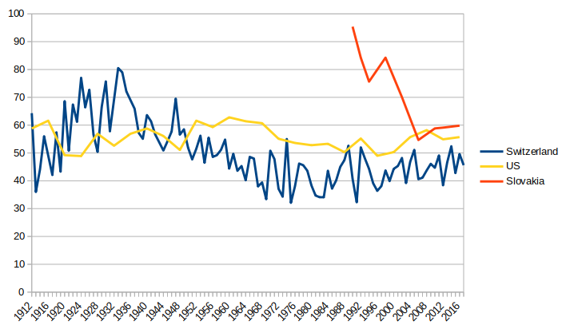

# Swiss Political System: More than You ever Wanted to Know (III.)

[Previous part](http://250bpm.com/blog:162)

When I've mentioned the failed referendum to limit urban sprawl to a Swiss friend he nodded and casually noted that government is already introducing some anti-suburbanization legislation.

Wait! What?

The people have voted against it and the government is still making it happen?

Where's the famed Swiss rule by the people?

And how come that he was not fuming with rage at the government so blatantly ignoring the will of the people?

Well, it turns out that vote against a proposal is not a vote for the opposite extreme. Vote against stricter zoning doesn't mean that the zoning should be relaxed. All it means is that status quo is preserved. The referendum has failed and the government could safely ignore it.

But while that explains why the Swiss haven't stormed [Bundeshaus](https://en.wikipedia.org/wiki/Federal_Palace_of_Switzerland) with pitchforks, it doesn't explain why did the government go an extra mile and introduced legislation clearly inspired by a failed popular initiative.

It's not that hard to explain though. You just have to put yourself in the government's shoes.

The result of the initiative haven't been spectacular (36.3% in favor) but the preliminary opinion polls have shown much larger support. At times it even looked like the initiative may succeed. So, presumably, a lot of people felt that something should have been done against the urban sprawl, but they disliked the particulars of the initiative.

If the underlying tension was not relieved, it would probably lead to similar initiatives in the future. And one of those may succeed.

But the government is not particularly thrilled about successful popular initiatives. First, they have no say in the exact wording. Silly things may get in, not because of ill will but because the text of the initiative was written without fully understanding the full scope of the problem and its on-the-ground consequences. Consider one of the government's arguments against the urban sprawl initiative, one, which the authors have clearly overlooked: The initiative would not allow to build greenhouses or poultry halls on agricultural land. The farmers would have to move them to the construction zones where the land is much more expensive. That, in turn, would harm the agriculture.

Second, the text of a successful initiative is incorporated into the constitution and is therefore set in stone. From that point on the government has to carefully navigate around its provisions and the more of them there are the more the terrain it has to operate in resembles a minefield.

All in all, it is, in the long run, much cheaper to introduce a law that addresses the concerns and takes the wind out of sails of any future initiatives, while, at the same time, not going as far as to get rejected in a legislative referendum by the opposing factions.

Similar spirit of compromise permeates all the Swiss political institutions. Political scientists even have a term for it. Ordinary democracy, as we know it from elsewhere, they call "competitive democracy" (individual parties try to win over other parties). Democracy in Switzerland they call "concordance democracy" (stakeholders try to find a compromise).

And while that may sound idealistic, an important lesson to learn from the above is that the compromise does not happen because of good will or brotherly love. It is rather the systemic result of how the mechanisms of the Swiss political system work.

### Concordance System

As much as I would like to write about concrete examples of compromises at all levels of government and society, the problem is that "spirit of compromise" is hard to quantify. When villagers meet in a pub and decide to solve a local problem by compromise, there's no paper record left behind. However, to understand the phenomenon, we do need data and that means paper record.

So, instead of looking at the problem of compromise in general, let's have a look at a substitute problem, the problem of distribution of seats in the government.

In competitive democracy each party is trying to usurp all the seats in the government for itself. If not possible, it tries to form the smallest ideologically coherent coalition that would still command majority of votes.

In concordance democracy, on the other hand, the seats are offered to all major parties in the hope that shared responsibility will bind them together and make them come up with well-balanced compromises.

Building of the concordance democracy is a historical process. When modern Switzerland was formed in 1848, nobody even though of shared governance. Single party - or rather ideological faction, parties came later - governed the country for decades. It was only in 1891 that first opposition politician got a seat in the federal council. In 1929, another opposition party joined. And yet another in 1943.

Following diagram shows how the seven seats in the Federal Council were distributed among the parties. Blue stands for [FDP.The Liberals](https://en.wikipedia.org/wiki/FDP.The_Liberals), orange for [Christian Democratic People's Party (CVP)](https://en.wikipedia.org/wiki/Christian_Democratic_People%27s_Party_of_Switzerland), green for [Swiss People's party (SVP)](https://en.wikipedia.org/wiki/Swiss_People%27s_Party), red for [Social Democratic Party (SP)](https://en.wikipedia.org/wiki/Social_Democratic_Party_of_Switzerland) and yellow for [Conservative Democratic Party (BDP)](https://en.wikipedia.org/wiki/Conservative_Democratic_Party_of_Switzerland). The diagram is getting gradually more colorful and tracks the progress of concordance mindset over the course of history.

### Opposition Enters the Government

In 1845, catholic cantons formed the so-called Sonderbund ("Separate Alliance") and split from the rest of the confederation. That led to the civil war among catholic and protestant cantons in 1847 won by the protestants. As a direct consequence of the war, the modern, federal Switzerland was formed and the cantons lost their independence.

Author: Marco Zanoli, <a href="https://creativecommons.org/licenses/by-sa/3.0">CC BY-SA 3.0</a>

The Catholics were thereafter looked at with suspicion, possibly as a prolonged hand of the pope, and haven't been given place in Federal Council for 43 years.

Between 1874 and 1891, however, they were able to form different alliances and sabotage the government by the means of referenda. Most importantly, they've been able to thwart government's plan for nationalization of the railways. That in turn lead to a government crisis. The crisis was eventually resolved by giving the opposition, for the first time in history, a place in the Federal Council.

Christian Democrat Josef Zemp became the head of the railway department. And although he used to be a passionate opponent of the nationalization before, now he took the government consensus for his own and began enthusiastically working on the nationalization project. So eagerly, in fact, that today he is remembered as one of the founders of the Swiss Federal Railways.

The modern understanding of the [collegiality principle](https://de.wikipedia.org/wiki/Bundesrat_(Schweiz)#Kollegialit%C3%A4tsprinzip) was thus conceived: Although the Federal Council consists of different parties, it speaks with one voice. The members decide on matters by voting among themselves, but once the decision is made every member stands behind it and defends it with official arguments.

In other words, the moment a person joins the Council, their main loyalty is no longer to their party. It is to the Council, and eventually, to Switzerland itself.

### Magic Formula is Born

In 1919, when the Liberals lost the absolute majority in the parliament, Christian Democrats got the second government seat. In 1929 agrarian BGB party (now SVP) joined the club.

At that point, the largest party that was still in opposition were the Social Democrats. And that was a big deal. Worker movement was strong in Switzerland. The general strike in 1918 almost led to a civil war. Bloodshed was prevented, rather miraculously, only by the distinctive Swiss ability to compromise.

Army is prepared to quell the general strike. Bern, 1918.

Still, the candidates of Social Democratic Party to the Federal Council were being rejected. And understandably so, given that the party still had dictatorship of proletariat in its programme.

But after its left wing split off to form the Communist Party of Switzerland the Social Democratic Party became more acceptable to the mainstream. In 1935 it rejected dictatorship of proletariat. In elections of 1943 it got 28.6% and became the largest party in the National Assembly. Shortly after, first social democratic federal councilor, Ernst Nobs, has been elected. (The fact that the memories of general strike were still around and that the governing parties didn't want to have workers against them while Switzerland was under the threat of Nazi invasion, may have also played a role.)

However, in 1953, when Social Democrats' attempt at reforming federal finances failed, Max Weber, successor to Ernst Nobs, resigned from the Federal Council and the party withdrew to opposition. At that point, the stage was set for the most important event in the history of the Swiss concordance, the introduction of the so-called Magic Formula.

The story begins with the liberals (FDP) electing their own representative to the free position in the Federal Council. From their point of view it was just the return to the pre-1943 state of affairs. From everybody else's point of view it was just FDP being greedy. FDP got 24% in the elections, after all, and CVP 22.5%, almost exactly the same. Yet FDP got four seats and CVP just two.

The fact that even the position of federal chancellor was taken by FDP and not granted to the junior partner in the government didn't make the things better. All of that has, understandably, caused resentment in CVP.

A short-sighted CVP politician may have focused only on winning one seat from FDP and achieving parity. The general secretary of CVP, Martin Rosenberg, however, realized that there's a different stable arrangement in sight, and, as it happened, one that was very compelling and had deep political logic.

If FDP, CVP and SP each got two seats and SVP one seat, it would not only almost perfectly match the election results. It would also address the two big splits in the Swiss society. First, it would mean that three federal councilors on the right (FDP and SVP) would be counterbalanced by two councilors on the left (SP). Second, the historically underrepresented Catholics (CVP), despite having just two seats, would become the balancing force between the right and the left.

The problem remained of how to get there.

To understand the complexity of the task consider how the selecting of a new councilor looks like. Not only are they expected to be from a specific political party, so that the existing balance of power is preserved. Balance between language regions is also important. Typically, at least two councilors are from either French or Italian speaking regions. The most populous cantons (Zurich, Bern and either Geneva or Vaud) tend to get one seat in the Federal Council each. At the time there was also a rule that there should be no more than one councilor from any particular canton. He or she should also, in the words of historian Urs Altermatt, be "cut out of average wood," i.e. they should not stand out too much. Finally, given that absolute majority of the Unified General Assembly (both chambers of the parliament) is needed to vote them in, they must be acceptable not only within their own party, but for the other parties as well.

The list or requirements sounds crazy. Finding even a single councilor would be hard. Luckily though, the candidate doesn't have to be a member of parliament. Every Swiss citizen is eligible, so there's a huge pool to draw from. Still, the complexity of finding a suitable person may be one of the reasons why the councilors are, if they don't choose to resign themselves, almost always re-elected. In fact, there's a strong taboo against removing an incumbent federal councilor. It ever happened four times. Twice in 19th century, never in 20th century and twice in 21st century. As a consequence, federal councilor spends on average ten years in the office.

Given these circumstances and the fact that Social Democrats adopted "two or nothing" motto, any attempt to change the composition of the Federal Council was a long project, requiring long-term trust between political rivals. Rosenberg also had to fight opposition within CVP, where a strong faction wanted to give Social Democrats at most one seat.

In any case, CVP contacted SP and asked them to support their candidate the next time one of the FDP councilors resigns. In return, they've promised that the new councilor would resign once another FDP councilor resigned. That would open space for two SP councilors. CVP itself would, in the long term, gain no additional seats but, as already explained, they would become the decisive factor between the political left and the political right. Social Democrats accepted the deal.

The first step of the plan was executed in 1954, when one of the FDP councilors resigned. With the support of SP the third CVP councilor was elected in his place.

CVP councilor Philipp Etter was now ready to resign at opportune moment. He even rejected vicepresidency in 1956 to keep all the options open.

The moment came in 1959 when multiple councilors resigned. Everything went according to the plan until SP nominated their party president, Walther Bringolf. Bringolf, with his communist past - I believe he knew Stalin personally, although he later turned away from hardcore communism - was not acceptable for large part of the parliament. CVP made it clear that their vote depends on the suitability of the candidate. SP still nominated Bringolf, but then almost nobody has voted for him, not even the SP parliamentarians themselves. Bringolf, seeing the result, gave up and allowed the members of the party to vote for whomever they wanted. Finally, a moderate candidate from SP was elected.

From there on, Magic Formula was respected for 44 years. As as with the government seats, the power was distributed fairly in other government-related institutions: In the Federal Court, in the military, in the state-owned companies such as Swiss Federal Railways, the post office, the national bank, or in the public television. Introduction of the Magic Formula has started the most politically stable period in the history of Switzerland.

### Towards Moderation

As we have seen with Walther Bringolf, it's the National Council that elects a Federal Councilor. Even though the claim of a party to a seat isn't disputed it doesn't mean that the official candidate of the party will be automatically elected.

It gets worse. The councilor representing the party may be elected against the will of the party.

In 1983, SP nominated Lilian Uchtenhagen, who would have been the first female federal councilor. But the parties on the right considered her politically too far on the left.

After several unsuccessful attempts to vote in different candidates seen as more moderate, a new candidate, Otto Stich, was nominated by the center-right FDP party. Otto Stich was a social democrat, but FDP considered him to be moderate, almost as he was one of their own.

He got elected and he accepted the election against the will of the SP leadership. The leadership then seriously considered retreating into opposition. However, plenary assembly of the party in 1984 decided against the idea.

In the end, Stich proved to be more left-wing than anybody expected him to be. FDP may have later regretted nominating him in place of Lilian Uchtenhagen.

While voting in a councilor against the will of their own party may be rare, this dynamic means that the federal councilors are generally chosen from moderate wings of their respective parties, resulting in low polarization within the council.

### Magic Formula is Broken

Up to this point, it may still seem that Switzerland is an old-world bucolic utopia, in which politicians bow to each other and say, "After you, sir!"

What we are interested in though is how the system copes with bad-faith actors and deliberate attemps to subvert it. System based on people being decent, on the rule by consensus seems to be particularly susceptible to such attacks.

Enter Christoph Blocher, the man whom Steve Bannon once described as "Trump before Trump".

Blocher is a great case study. He's capable, he's rich, he's a great speaker and his political project (independence, neutrality, self-sustainability, anti-immigration) has a huge appeal in the Swiss society. At the same time he's willing to fight unfair, bend the rules and even break the Swiss political system to achieve his political goals.

In 1972, Blocher, originally a lawyer and businessman, joined the Swiss People's Party, an agrarian party whose main agenda at the time was centered around the price of milk. In 1977, he was elected the president of the Zurich chapter of the party and began to transform it into a modern right-wing populist party - something yet unheard of in the rest of Europe. He focuses on the anti-immigration and anti-European agenda. The result is an increase in the party's preferences in the canton.

He gradually gains influence in the party, mainly at the expense of the old, moderate wing. His high point comes in 1994 when he helps to prevent Switzerland joining the European Economic Area. As the party gradually takes over Blocher's agenda, its preferences grow until, in 1999, the once smallest coalition partner becomes the strongest party in the parliament (22.5%).

Animated graphics showing how SVP ceased being a traditional economically conservative and socially progressive party and, while remaining economically conservative, quickly moved towards socially conservative end of the spectrum, can be found [here](https://blog.tagesanzeiger.ch/datenblog/index.php/1791/wie-sich-die-svp-aus-dem-buergerblock-verabschiedet-hat). (By the way, the graphics also shows the ongoing centralization of Swiss politics: Note how cantonal chapters, represented by small dots, draw closer to their respective national party over the years.)

Unlike right-wing populist parties elsewhere though, SVP puts emphasis on democracy. In particular, it stresses direct democracy, while at the same time downplaying the rule of law. SVP doesn't like the idea of people deciding only on the rules which are then applied by impartial institutions. They would like the people to decide on particular cases. An example of this would be their failed attempt in the city of Zurich to start granting citizenship by ballot. (This has been tried in year 2000 in the municipality of Emmen and it turned out that a lot of candidates were turned down just because they happened to have Yugoslavian-sounding names. On the other hand, a girl from Montenegro with an Italian-sounding name has got the citizenship. The procedure was declared to be unconstitutional by the Federal Court in 2003.)

An online game from SVP. The player is asked to fight aliens, the Greens and the judges.

Blocher himself became a member of the government of the canton of Zurich in 1975, and a member of the federal parliament in 1979.

In parliamentary elections in 2003, SVP gains 26.7% and Blocher demands a Federal Council seat for himself.

And while, numerically, SVP has justified claim to the second seat, the Magic Formula was originally intended to balance the forces on the left with the forces on the right. With the right-wing SVP getting a second seat at expense of the CVP the balance between right and left becomes 4:2, with centrist CVP, now having only a single seat, no longer being able to make a difference.

There are other reasons not to vote for Blocher. In 1994, during a vote in the National Council, he voted not only for himself, but also pressed the button of his absent colleague. In 1999, he was convicted by court for his anti-Semitic statements. And in general, his authoritarian and uncompromising attitude directly clashes with the consensual way how the politics are done in Switzerland.

But some still favor making him a federal councilor. Carlo Schmid (CVP): "In would be an error not to elect Blocher to the Federal Council. ... Blocher has an enormous disruptive potential. That potential must be neutralized."

That may sound strange, but that's how Swiss politics work. One doesn't try to lock their opponents out. One rather offers them a trade of getting access to power in exchange for submitting to the consensus. We've already seen this happen with Social Democrats half a century earlier.

But it can also be though of as education: When Blocher becomes a federal councilor, he enters a group of people who are working together for years, unlikely to be removed, not supposed to be driven by the interests of any party, bound together by the principle of collegiality. The members change one at a time and the body therefore has a lot of continuity. It has evolved a specific [culture](https://www.youtube.com/watch?v=dvodASdJ5Hs), that is passed from generation to generation since 1848. The new councilor is expected to become part of that culture, to, so to say, grow up and put the interests of the country above the interests of their party.

To give a concrete example, it sometimes happens that a new federal councilor can't resist the temptation and violates the collegiality principle by hinting at how they've personally voted. Afterwards, they they have to face a lot of criticism, both from within the council and from without. Eventually, they learn the lesson.

So, these were the expectations when Blocher was elected to become a Minister of Justice and Police in 2003. Along the way, Magic Formula was broken and an incumbent councilor was not re-elected for the third time in the Swiss history.

### The Most Successful Conspiracy since Brutus

At least that's how the 2007 de-election of Christoph Blocher from the Federal Council was called by the press.

But let's get back to what happened. By 2007 SVP gains even more votes (29%) but at the same time it is already clear that Blocher refuses to grow up. Although a federal councilor, he still does opposition politics. Not only he breaks the principle of collegiality, he attacks it head on. Here's an example where he manages to do both at the same time: "The vote in the Federal Council about entering the Schengen area hasn't been unanimous and even today the entire council doesn't stand decisively behind the project. ... Some people believe that the government can decide that the Earth is flat and that the collegiality principle prevents a councilor to say that it is round!"

He doesn't give up his populist antics either. In 2006, he breaks presumption of innocence by referring to two immigrants under investigation as criminals. When questioned about it he lies to the senate. However, he is convicted by a video recording.

His opponents also accuse him of ignoring parliamentary decisions, of trying to control the parliament with threats, of criticizing court decisions and of delaying bills that he does not like.

All that being said, everyone still expects him to be re-elected.

Social Democrats feel there is a chance though. They know that the majority in parliament is fed up with Blocher and getting rid of him hangs only on finding a viable counter-candidate.

But finding one is not easy.

First, it must be someone from SVP. Candidate from any other party would face opposition from both SVP and at least one other party and would have no chance of getting the majority of votes.

Second, SVP already announced that whoever accepts a counter-nomination for Federal Councilor would be expelled from the SVP parliamentary faction. Therefore, SVP parliamentarians would be under strong pressure not to accept the nomination, even if they were elected.

Third, the candidate would have to make for a competent federal councilor. People would not vote for a random nobody.

Fourth, the counter-candidate would have to be better than Blocher himself. At least, he or she should be willing to accept the rule of law and the collegiality principle.

SP decided to go on with Eveline Widmer-Schlumpf, a member of the old, moderate, milk-price-oriented, wing of the party. At the time, she was not a member of federal parliament and so she was, to some extent, immune to Blocher's threats. She was the president of the Conference of Cantonal Ministers of Finance, which, as you may remember from the previous part, is a body operating on the national level, but parallel to the federal government. That is, she is no newbie to the big politics. In fact, Widmer-Schlumpf was considered a good candidate for a Federal Councilor by SVP itself. In 2003, the party president and ally of Blocher, Ueli Maurer, describes her as "a very valid candidate, one of the most competent politicians in the country." In other words, she was no leftie secretly infiltrating the conservative SVP.

Moreover, the party's radicals now have the upper hand and just a week before the election they remove two dissenting deputies from the Graubünden section of the party (which Widmer-Schlumpf belongs to) from important parliamentary commissions. One of them describes the conditions in the party as "dictatorship". SP counts on Widmer-Schlumpf not being amused.

Social Democrats contact the leadership of the centrist Christian Democrats. They propose to elect Widmer-Schlumpf instead of Blocher and they get their support.

They manage to make a secret agreement with the Greens to withdraw their own candidate, who had no chance of winning anyway, at the last minute.

Even some individual members of the right-wing Liberal Democratic Party are contacted. The party is officially in favor of Blocher, but he is unpopular in the French and Italian-speaking cantons and some parliamentarians from these cantons may be willing to vote against him.

The result of the vote comes as a shock to the People's Party. The party's sovereign leader is not re-elected and the current outsider, Mrs. Eveline Wider-Schlumpf, becomes the new representative of SVP in the government.

SVP asks Wider-Schlumpf not to accept the position. She asks for a day to decide. Demonstrators, mostly leftists, in front of the Bundeshaus are, funnily, expressing support for a right-wing politician. Large banner they hang out reads: "Eveline, say yes!"

The next day she indeed agrees and becomes a competent federal councilor for next eight years. She has extremely high approval numbers and in 2008 she even wins the award "Swiss Person of the Year".

### The Soap Opera Continues

It wouldn't be Blocher if he haven't tried to fight back.

Christoph Blocher during the campaign against joining the European Economic Area (1992).

When Widmer-Schlumpf accepts the seat he aims for exemplary punishment and wants her to get thrown out of the party. Same applies to the other SVP federal councilor, Minister of Defense Samuel Schmid, who refuses to resign in favor of Blocher.

But there's a catch. The Swiss People's Party is a union of its cantonal chapters and as such it cannot exclude individual members. The party leadership therefore asks the People's Party of the canton of Graubünden to expel Widmer-Schlumpf. The cantonal section says no way. The party leadership threatens to exclude the entire cantonal chapter if it does not play along. The chapter replies that whatever.

In 2008 the Swiss People's Party of Graubünden is therefore excluded from the national People's Party. It renames itself to the Conservative Democratic Party (BDP) and stands in the next election as a separate entity.

Similar scenario takes place in the canton of Bern. The party's cantonal section refuses to expel the incumbent councilor Samuel Schmid. Although the party leadership does not resort to the same drastic measures as was the case with Widmer-Schlumpf, it publicly declares that the elimination of Schmid would be a waste of time and that he is already "clinically dead" anyway.

A large part of the People's Party of the canton of Bern, including seventeen members of the cantonal parliament, therefore joins the new BDP party. Similar scenario plays out in the canton of Glarus.

Blocher announces that from now on, People's Party will be pursuing opposition politics. In the Swiss context, it means trying to sabotage the government by referenda.

When Samuel Schmid resigns from the Federal Council in 2008, SVP nominates Christoph Blocher again. However, it is immediately clear that he has not chance of winning. What's worse, SP tries to pull the same trick again: They nominate Hansjörg Walter, a moderate SVP politician from canton Thurgau and the president of Swiss Farmers' Union. 

After the first round of voting where no candidate gets the majority, the party, scared, pulls out Christoph Blocher. The party president, Ueli Maurer, is nominated instead. But he's not seen as any more moderate than Blocher himself and many fear that with Maurer, the entire Blocher story would repeat anew.

In the second round of voting the moderate candidate gets two more votes than Maurer does and needs only a single additional vote to get the absolute majority.

The president of SVP parliamentary faction addresses the deputies and begs them in the name of Christoph Blocher (to everyone's amusement) to vote for Maurer.

Finally, in the third round, Maurer wins the election by a single vote.

It has to be said that Maurer, unlike Blocher, has grown into the position and turned out to be an acceptable federal councilor.

In 2011, after new elections, the People's Party once again tries to take advantage of the Magic Formula and gain the second seat in government. They want to replace Widmer-Schlumpf, who is now a member of a different party, by their own candidate (not by Blocher). Nevertheless, when deputies are given a choice between two traditions, the tradition of the Magic Formula and the tradition of never de-electing incumbent councilors, they decide to prefer the latter principle and re-elect Widmer-Schlupf.

When People's Party gets its all time best numbers in the elections in 2015 (29,4%) and Widmer-Schlupf's new Conservative-Democratic Party only 4%, the councilor voluntarily resigns. People's Party decides to play the card of national cohesion rather then taking a risk of nominating Blocher again. One of the three candidates is from the French and another from the Italian-speaking part of Switzerland. Finally, Guy Parmelin, a relatively moderate candidate from the canton of Vaud, is elected.

The concordance, after twelve years of troubles, becomes fully operational again.

### Rule by Consensus

I've chosen to write about the history of Magic Formula in painstaking detail. The idea of concordance and rule by consensus is so alien to the people for competitive democracies that nothing less, no theoretical explanation, would be able to convey how it works. The reader would be left to choose between disbelief and incorrect assumption that Swiss are a bunch of clueless hippies.

That being said, what is the actual mechanisms that makes the Swiss political system tick?

In my opinion, the core of it lies in the fact that everyone is in minority, every time. Switzerland, thanks to its diversity, gets that for free. However, unlike, say, similarly diverse Afghanistan, it managed to turn that disadvantage into an advantage. Instead of fighting each other forever and getting a failed state in result it somehow managed to move the struggle from the military to the political domain. What's more, it managed to fight the problems not by homogenizing and centralizing the country, but rather by making the diversity - and thus the general circumstance of being in minority - the leading principle of its political system.

You want to be a federal councilor? You are left at the mercy of your political opponents. It doesn't matter that you are the strongest man in the strongest party. You have to try hard to placate the others so that they vote for you.

You became a president and now you think you are all-powerful? Well, you can't do anything unless you are able to convince and compromise with the remaining federal councilors, who are, for the most part, your ideological opponents. 

You want a certain law to be passed? You have to make sure it won't be challenged in a referendum. You have to thing twice and thrice about which particular group you've forgot about, which is going to be angered enough to launch a referendum. Then you have to negotiate with them and compromise.

### Consequences: Legitimacy of Government

With all the above being said, here's the interesting question: What is the legitimacy of Swiss government?

There are many possible ways to measure it, but let's have a look at the simplest one: How many voters have voted for the parties, which then got a seat in the Federal Council?

Before interpreting the graph, consider the following two facts: The area below fifty percent is reserved for undemocratic regimes (minority rules majority). Also, 100% is an unattainable goal. There will always be some people with fringe political views who won't be represented in the government.

For comparison, I've added the data for the US and for my native Slovakia (I couldn't resist the urge. Sorry.) In the US case the graph represents the portion of voters who voted for the ruling president. In the case of Slovakia it's people who voted for the coalition parties.

As can be seen, both countries wobble around 50%. Naively, one would expect that legitimacy in a democratic country cannot fall below 50%. Whoever is supported by less than half of the voters should be outvoted and unable to form a government. In reality, however, there are many ways to fall into this trap. A country may have a weird electoral system (US), it may have a minority or bureaucratic government (Belgium) or, as in the case of Slovakia, quotas for entering the parliament can leave a large part of the voters (28.5%) without representation in the parliament, let alone in the government.

In reality, legitimacy close to 50% seems to be quite common in competitive democracies. It kind of follows: With competitive mindset one wants to band together with only as many competitors as it takes to get the majority. Going any further means unnecessarily "losing" the contest.

The concordance democracy in Switzerland, on the other hand, oscillates, since the introduction of Magic Formula, around 75%.

In 2019, the legitimacy declined somehow due to the high electoral gain of the Greens, who traditionally have no representation in the Federal Council. All other parties agree that it would be appropriate to give them a seat, but none of them wants it to happen at their expense. In any case, if any of the proposals put forward at the recent summit on the issue was implemented, the government's legitimacy would rebound back to at worst 82 and at best 90 percent.

### Consequences: Trust in Government

Next, let's have a look at whether the high legitimacy of the government is reflected in the trust of citizens in the government.

Source: OECD's "Government at a Glance" report

It's hard to generalize from a single data point, but indeed, it looks like concordance democracy may result in higher overall trust in government. Both the US and Slovakia are somewhere around 35%. Average of OECD countries is somewhat higher, 45%, but still way down below Switzerland's 85%.

Let me diverge from the topic for a second and make a remark about trust in general.

When I've moved to Switzerland I've been warned couple of times that the neighbors there won't think twice before ratting on me.

And while that's true - although reporting to the authorities is usually preceded by passive-aggressive messages in one's mailbox - the context is very different. 

In Eastern Europe and, I guess, in many other places, reporting to authorities is seen as morally wrong. There is a kind of stubborn popular solidarity in resistance to power. We may have inherited that attitude from the times when ratting on someone meant that men in leather trench coats arrived early next morning and dragged the victim to Gulag. (I've even heard a story about a small Slovak town where, shortly after World War II, people began reporting their personal enemies to the Russians, claiming that they were Nazi collaborators. Russians had no clue and incarcerated every reported person. The feud spiraled out of control and several hundred people ended up in jail.)

Swiss, on the other hand, don't perceive authorities as necessarily hostile. If a neighbor violates a rule (and people have quite likely voted for that rule or at least haven't objected when it was introduced) he should be warned first, and if that doesn't help, reporting him to the authorities is seen as fully justified. Nothing terrible is going to happen anyway. Most likely, the authorities are just going to ask the person in question to behave.

But it is not just the neighbors that people are complaining about. Complaints seem to be a popular pastime. If something is not working smoothly, be it a person or an institution, it is a reason to complain, and surprisingly, complaints often lead to solving the problem. In result, Switzerland has a fantastic, effective bureaucracy.

In short, there is a certain degree of trust ("armed trust" may be a better description), on the one hand of people in the authorities, on the other hand also of the authorities in the people. There is a certain implicit assumption that if a person has broken a rule, he has not necessarily done so on purpose and does not need to be punished immediately. Everyone is watching closely though whether the "mistake" was really a mistake or whether it happens again.

A nice illustrative example on the topic of trust are the quarantine measures during the Easter holidays of 2020. The government decided not to ban traveling but rather to put trust in the people and issued a recommendation to behave responsibly and not to travel.

On the first day, police of canton Uri reports that they are stopping cars on the road to the Gotthard Tunnel and convincing people not to travel. Police spokesperson reports: "We haven't convinced anyone yet."

The next day, they report the first success: "One car turned around and went home. It seems that the message is getting through."

However: "About 98% of those stopped have a good reason to travel to Ticino - because they live there, or have a family there, or very important responsibilities. Very few people travel there on vacation or for fun."

And as funny as it sounds, it must be said that the road beneath the Gotthard Pass, notorious for bad traffic jams during the Easter holidays, was almost completely empty this year. Contrast it with the Slovak government which tried to limit the travel during Easter holidays and caused massive traffic jams a day before the restrictions came into effect.

On the other hand, after government made few mistakes in handling the crisis (such as downplaying the importance of masks, once publishing wrong number of infection cases and, to everyone's horror, reporting that a nine-year-old girls has died, only for it to later turn out that the girl was in fact 109) a local tabloid concludes - showing how important the trust is considered to be: "\[Director of the Federal Health Bureau\] has asked the cantons, because of the rising corona numbers, to step up the measures. Among other things he recommended the usage of masks in shops. Up to this point hardly any canton has followed the recommendation."

### Consequences: Election Turnout

It may not be directly related to the topic, but it is interesting to have a look at whether high trust in the government correlates with high election turnout.

That appears not to be the case. Turnout in Switzerland is chronically weak, oscillating around forty-five percent.

A mixed bag. Turnout at referenda in Switzerland. Turnout at presidential elections in the US. Turnout at parliamentary elections in Slovakia.

However, a detailed analysis shows that the situation is not that simple. It is not the case that half of the Swiss never vote. It turns out that about a quarter votes almost every time, a quarter almost never, and the rest votes occasionally. That being said, 90% of people have voted at least once in the past five years. This suggests that people vote selectively. If a referendum is about education, it is only natural that people without children in school ignore the vote. On the other hand, it is true that a certain part of the electorate can be only lured to the ballot box by simple topics with a big emotional appeal, e.g. restrictions on immigration.

**August 10th, 2020**
