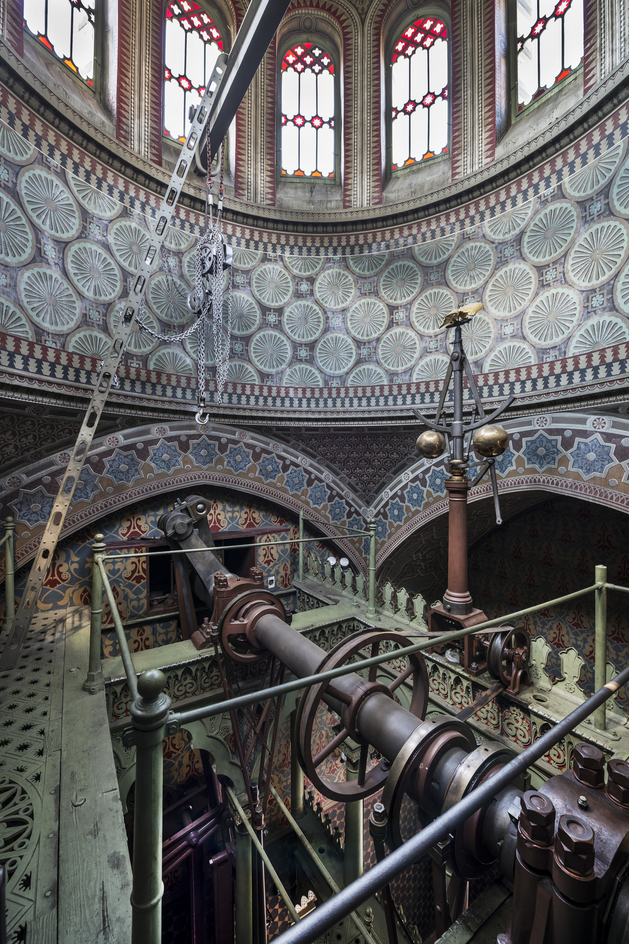

# Steampunk in XIX. century

[Sanssouci Steam Engine House](https://de.wikipedia.org/wiki/Dampfmaschinenhaus_f%C3%BCr_Sanssouci) in Potsdam is a unique example of steampunk art coming directly from the century of steam. Built in 1842 to power the big fountain in Sanssouci park, the machine consumed four tons of coal per day. The coal was transported from Silesian coal mines by ship over Havel river. The chimney was disguised as a minaret.

360° panorama can be found [here](https://www.spsg.de/schloesser-gaerten/objekt/dampfmaschinenhaus-moschee). Alternatively, watch some pretty impressive [footage of the machine at work](https://youtu.be/SdvqR-YI7TM?t=3450).

**August 30th, 2020**
