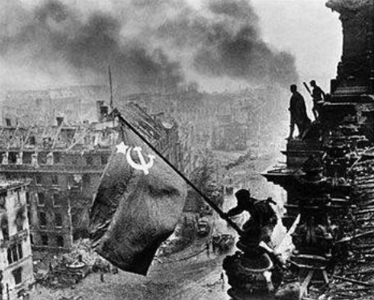
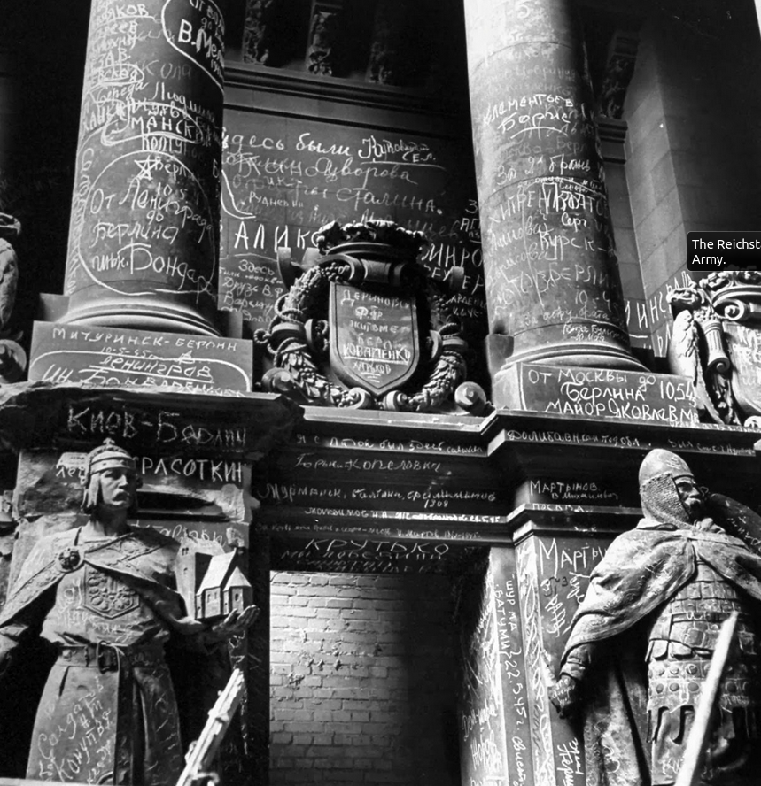

# The Story of the Reichstag

When the Red Army was conquering Berlin, capture of Reichstag was seen as an important symbolic act. For Russians, the Reichstag was a symbol of the Nazi Germany. Nazis, however, never used the building, seeing it as a symbol of the despised democracy. As you may remember, they've rather set it on fire and blamed the communists for the deed.

When the building was finally captured Soviet soldiers flew a red cloth from the roof of the building. The iconic photograph of the moment is not entirely truthful though. Hammer and sickle has been added a few days later as was the rising smoke in the background. The editor has also noticed that the soldier securing the soldier who was holding the flag had watches on both wrists. He corrected the error using a needle.

Soviet soldiers, as they were progressing westward through the Eastern Europe, were notorious for looting watches. Some of them were wearing multiple on each wrist.

As the old joke goes: What did marshal Konev say when they were dragging the Prague astronomical clock away? "Часы тяжелые." ("The times are hard." or, alternatively, "The clock is heavy.")

When a footage from Yalta conference was shown in cinemas in Eastern Europe, the sequence where Roosevelt shook Stalin's hand unvariably elicited cries of "Mind your watch!"

To veer off in completely random direction: When George W. Bush visited Albania, the footage of him shaking hands with the crowd shows a watch on his wrist at one moment but no watch few seconds later. Immediately, conspiracy theories sprang up. They were, however, quickly debunked by the White House spokesperson: "The President has not been robbed. He took his watch off."

Anyway, back to the Reichstag.

Red Army Soldiers covered the building with graffiti.

These were simple inscriptions saying "Kiew - Berlin. Krasotkin." "From Moscow to Berlin. Major Yakovlev." "Sergey was here." and similar.

When the building of Reichstag was being repaired after the war it turned out that cleaning the walls would be too expensive. Those were poor times. The builders therefore decided to build clean hallways just by raising a thin smooth walls covering the original walls.

After the unification of Germany, when the Reichstag was being repurposed to become the seat of the parliament once again the builders drilled a hole into the outer wall and discovered that the old Russian inscriptions were still there, untouched.

It was decided to remove the wall and leave the graffiti at different locations in place, on public display.

I think the fact reveals something about the German political culture. I am having a hard time imagining that, say, Americans would keep such a witness of their defeat in the Capitol. That is, if the soldiers from Pearl Harbor were somehow able to get to Washington and leave japanese inscriptions behind.

What I, personally, like about it is its ambiguity.

The inscriptions can be interpreted in a crude way. As a message to german parlamentarians: Mess it up and you'll see the cossacks in the Reichstag again.

But there's also a much more subtle, even intimate, interpretation. Note how there's no Stalin's declaration of victory in the building. But there are graffiti from all those Andreys and Georgiys, common boys dragged out of their villages, sent fighting, killing, being killed, seeing their freinds dying, looting and raping along the way until they arrived in Berlin. Those inscriptions are a reminder that Germany is not an island for herself. That those people, whether she wills or not, are part of her fate as much as they are part of the fate of Russia.

**February 5th, 2012**
