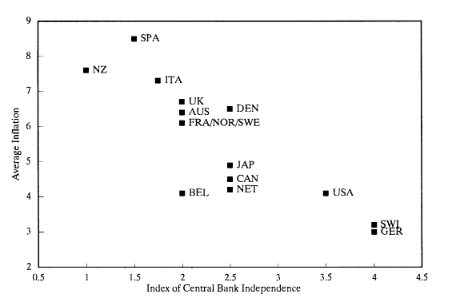

# Democracy, Bureaucracy, Central Banking

Huge parts of our societies are managed in non-democratic, bureaucratic way. (I am using the term bureaucracy in the old Weberian sense. If you are living in XXI. century feel free to replace the word bureaucracy with technocracy - although, I guess, in technocracy the bureaucratic positions are filled by scientists and engineers rather than by landed gentry as was the case in Weber's Germany.)

People, of course, disagree on how to proceed. Should we continue the historical trend of societies becoming more democratic and make bureaucrats more accountable? Or should we continue the historical trend of governance becoming more efficient and get it rid of the soap opera of the partisan politics?

A nice little example of this dilemma is central banking.

I am not a historian, so I am not going to deal with the emergence and early times of central banks, however, my understanding is that the meandering between the political control and bureaucratic independence has always been there. (The banks emerged as private enterprises with state monopolies, then got nationalized etc.)

When entering the modern times, there was a strong political influence in most central banks.

This was causing problems. Think of it: Why not induce a short term boom before the elections to get voter support for the incumbent party and then compensate by deflating after the votes are counted? But that means that the central bank doesn't do what it is supposed to do, namely to react to the existing economic circumstances and keep the economy afloat. Rather it just follows the electoral cycle. What's worse, financial markets can take advantage of those predictable shifts in monetary policy and simply price them in.

To be more bland, here's a graph from 1993 paper by Alesina and Summers showing how inflation rate correlates with the independence of the central banks from the politics:

In 1990's there was a large shift towards central bank independence, that is, away from the democratic and towards the bureaucratic control.

Note that these were 1990's, the times of "end of history" and the heyday of the democracy after the fall of the Ostblok. Yet, apparently, central banking has just too important to be left to the democratic control.

If you like anecdotes better than theory, here you go: When President Erdogan of Turkey announced in 2018 that his first act after re-election will be to take control of interest rates from the Central Bank of Turkey the Turkish Lira quickly dropped by 10 percent. 

But not all is rosy with the bureaucratic approach, especially after the 2008 crisis. In places, where the central banks were involved in bailouts they were suddenly asked to do politically highly salient decisions. To choose who to bail out and who not to. To pick winners and losers. This become so political that, for example, Slovenian central bank governor has resigned after receiving death threats.

The problem became very apparent in handling of the Greek government-debt crisis by the so called Troika (European Central Bank, European Commission and IMF). European Central Bank was estalished in 1998 and it is very independent even as central banks go. Suddenly, the unelected bureaucrats from ECB were supposed to decide on the fate of entire nation and, not surprisingly, most of the people in Greece felt that was wrong.

Now, I am not claiming that I fully understand the problem. However it seems to me that the democracy/bureaucracy dilemma is not going to be won by either of the sides. More likely we are going to preserve the mix of the two. Quite possibly, it's not even a zero sum game and instead of shifts in power between the two we'll get stronger democracy keeping more powerful bureaucracy in check. In any case, the case studies, such as the history of central banks, are going to important to understand how the efficient balance should be established.

**February 7th, 2021**
