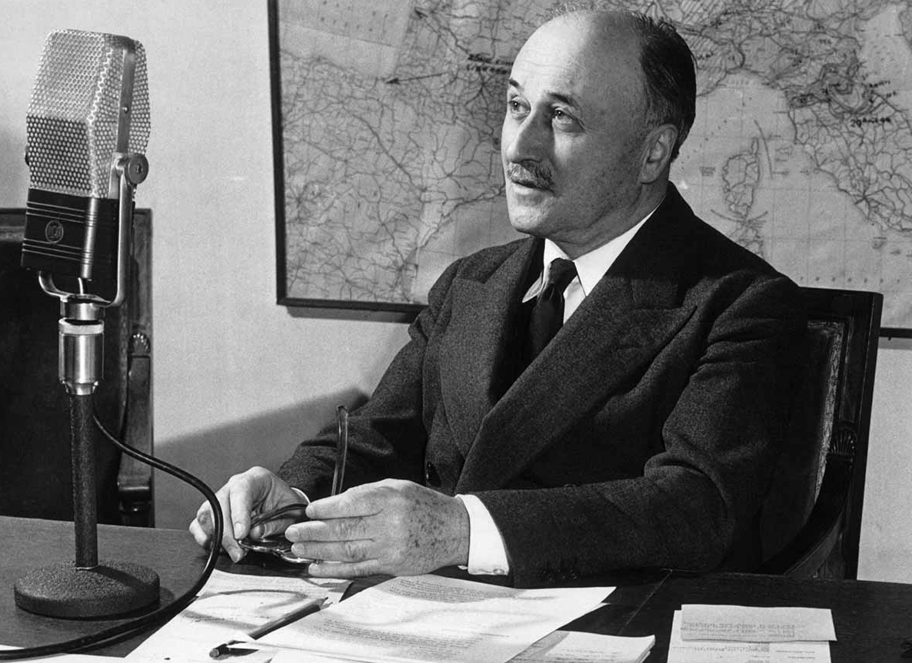

# Jean Monnet: The Guerilla Bureaucrat  

_I have written about coordination problems from various points of view in the past ([biology](https://250bpm.com/blog:135/index.html), [economics](https://250bpm.com/blog:128/index.html), [sociology](https://250bpm.com/blog:132/index.html), [political science](https://250bpm.com/blog:161/index.html)) but this time I am about to focus not on the theory, but on the practice._

Jean Monnet was one of the founding fathers of the European Union. One may even say that he was the architect of the European Union. However, as founding fathers go, he was rather unusual. His background was unusual: He was neither a political leader, nor a lawyer, a philosopher or a military commander. He was a son of a brandy merchant from the small town of Cognac near Bordeaux and himself a merchant by trade. He dropped out of school at sixteen and never got any extensive formal education.

But also his approach was unusual: He never held an elected position, he has never put himself to the forefront, he almost never made big speeches and is not known for memorable quotations. Rather, he was always in the background, busy with the boring technical work, hanging around politicians, showing them his famous balance sheets and trying to convince them to do the sensible, if unexpected, thing.

He was, in fact, so undistinguished that, when Fortune magazine run a story about him, they have given up on inventing a proper title for him and introduced him simply as "Monsieur Jean Monnet of Cognac". But whoever he was in his life - a trader, a banker, a civil servant - the only description that truly fits is that he was a solver of coordination problems.

## The Monnet Method

This article will explore what Mario Draghi (former president of European Central Bank, and now, quite unexpectedly, the Italian prime minister) calls "[the Monnet method](https://www.ecb.europa.eu/press/key/date/2017/html/ecb.sp170504.en.html)", a bunch of principles that guided the effort to unite the continent divided by centuries of incessant wars and feuds.

But while Draghi is focusing on the lessons that may be relevant in the current state of the European Union, my interest is a bit broader: How does one solve coordination problems in general? And how does to do it as successfully as Jean Monnet once did? 

In this article we are going to examine that question. Yet, before we begin, a warning is due. Monnet himself, in his memoirs, refuses to write down his method:

> I might have written a series of practical maxims; but I distrust general ideas, and I never let them lead me far away from practical things. I have described the dramatic events I have lived through and the lessons I have learned from them, in the hope of preventing their happening again. My purpose is very practical. Some may call it a philosophy, if they prefer: but the essential point is to make it useful beyond the experience of one individual.

And that, I think, is not Monnet being modest. It's the core of his approach. The only way to break out of inadequate equilibria, to solve the coordination problems, is to take advantage of the unexpected. Everything that is expected, after all, just feeds into the equilibrium and makes it persist. And to take advantage of the unexpected, one should not bind himself to a specific, predictable method.

## Bypassing the Hierarchy

One recurring theme in Jean Monnet's life was working outside of the existing institutions. The common sense would have it that to change how Europe works, he should have found a humble job at French ministry of foreign affairs and work his way up the hierarchy until he had enough say to push his ideas forward. Instead, it's 1914, the beginning of the Great War. Monnet is 26 years old and has no prior political experience:

> One of our friends at Cognac was a lawyer, Maitre Fernand Benon, who happened to know René Viviani, the Prime Minister, quite well [...] and he agreed to introduce me to [him].
>
> [...]
>
> Viviani said to me: "Sir, I gather that you have some interesting proposals. Tell me."
>
> "The problem lies in using to the full the decisive contribution of Britain's economic Power. At the moment, we don't know how to do it. And so long as we fail to allocate responsibilities according to the ability of each side, the Alliance will remain a mere juxtaposition of two separate Powers. At present, despite all the good intentions of those responsible, there are absurd instances of waste and unnecessary duplication."
>
> Viviani interrupted. "Can you give me some examples?"
>
>  "The merchant fleets have not been fully requisitioned. There are good reasons for that, I know. But is there any reason why they should compete with each other, why they shouldn't charge the same freight rate and why their cargoes shouldn't be co-ordinated so that at least priority supplies get through quickly? You're worried at the moment because the price of oats has gone up. But it's not the price that's gone up - it's the cost of shipping them."
>
> "What do you propose?"
>
> "We need to set up joint bodies to estimate the combined resources of the Allies, share them out, and share out the costs."
>
> "But we already have machinery for inter-Allied co-operation, and I'm told that it works well."
>
> "That's nothing more than a communications system. It doesn't take decisions or make choices. We're beginning to suffer from shortages, and we must devote our resources to the most rational ends - all our resources - all our joint resources. It's this, I believe, that's still not understood. Allied solidarity must be total. In other words, neither side must be free to use its men, its supplies, or its shipping in ways that haven't been agreed by both."
>
> "I see what you mean: but you must realize that we are talking about two Governments and two sovereign Parliaments. Can you imagine these joint decisions being taken simultaneously?"
>
> "I know the British well enough to be sure that we can reach a real agreement with them if we appeal to their loyalty and if we play fair. They know what a terrible burden the French armies are bearing for the common cause. They will agree to make the biggest contribution in the fields where they are supreme - in production and shipping."
>
> "I think so too, but it's hard to broach the subject at a time when we're asking them to send more troops. You seem to have some idea of how to go about it. Try. I'll tell Millerand [French minister of war] to expect you. Explain to him what you've just told me."

I've quoted the story in full because it captures the essence all the later conversations Monet had with politicians. Both in its substance - that is, coordination between countries - and its unexpected, bold, almost cheeky style. A random nobody arrives from the blue and makes grandiosely far-fetched proposals, which, nonetheless, often get accepted by the people in power.

Here's what Monnet has to say on the topic himself:

> Although it takes a long time to reach the men at the top, it takes very little to explain to them how to escape from the difficulties of the present. This is something they are glad to hear when the critical moment comes. Then, when ideas are lacking, they accept yours with gratitude - provided they can present them as their own. These men, after all, take the risks; they need the kudos.

Or, hitting closer to the problem of inadequate equilibria, he explains: 

> However far-sighted they may be, Governments always find it difficult, and very often impossible, to change the existing state of affairs which it is their duty to administer. In their hearts they may wish to do so; but they have to account for their actions to Parliament, and they are held back by their officials, who want to keep everything just so.

In short: When it comes to coordination problems, always speak to the most powerful person around. For it is they who, if anyone, have enough power to break the existing institutions and thus escape the existing deadlock.

## The Better Nature of Men

As a side point to the previous section - and although Monnet doesn't explicitly say so - speaking to a person, as opposed to dealing with an institutional process, brings in considerations that don't exist within the institution.

Here's how Monnet finishes the story above:

> Leaving Viviani's office, I found Fernand Benon waiting in the hall of the Faculty of Letters. He told me that Viviani had just that morning heard of the death of his two sons in the Battle of the Marne.

He puts it as dryly as that. He doesn't elaborate. But the reader is left to wonder whether such a personal tragedy have made Viviani more prone to act in unorthodox ways. Whether he was more prone to disregard the business as usual and focus on efficiency, even if it meant supporting a young man with ludicrously far-fetched proposals.

Similar point can be made about creation of European Coal and Steel Community, the predecessor to the European Union. The people involved may have come from different countries, often traditional enemies, locked into inadequate equilibria, promoting their own interests at the expense of the whole. But, on the other hand, each of them has lost friends and relatives in the war and often it took as little as to look out of the window to see the ruins and the destruction caused by the malfunctioning system.

A casual visitor to the community offices in 1955 notes:

> The men who worked on the Treaty of Paris were men who had fought two wars, lived through two wars, and were determined to forge a future that would turn its back on that past. [...] In the General Secretariat there was Kohnstamm, who was Dutch and had been in the Resistance, and opposite him, there was a German called Winrich Behr. Winrich Behr had been on the staff of Field Marshal Paulus during the battle of Stalingrad and had had the task of bringing to the Führer the news of the Stalingrad army’s surrender; he was also on Rommel’s staff in the Afrika Korps during the North African campaign. [...] So there was a German, a Frenchman, Rollmann, who was a Luxembourger, there were Belgians, and so on. [...] these men, who did not know one another and had even served in opposing armies, came together and a friendship sprang up among them. That is what I felt, and as a Swiss, it made a great impression on me. My conclusion was that these men who had fought were now closer to one another than we, who remained or found ourselves outside.

Monnet expresses the same sentiment in a less poetic way:

> Werner Klaer and Roger Hutter, one German and the other French, sat opposite each other in the same office. They recognized and confessed the ways in which, in their national rail systems, they had both manipulated freight-rates to distort free competition. Together, in the closest collaboration, they now spent months undoing a skein of national
discrimination.

## Crises are Opportunities

> At this most fateful moment in the history of the modern world the Governments of the United Kingdom and the French Republic make this declaration of indissoluble union and unyielding resolution in their common defence of justice and freedom against subjection to a system which reduces mankind to a life of robots and slaves.
>
> The two Governments declare that France and Great Britain shall no longer be two nations, but one Franco-British Union.
>
> The constitution of the Union will provide for joint organs of defence, foreign, financial and economic policies.
>
> Every citizen of France will enjoy immediately citizenship of Great Britain; every British subject will become a citizen of France.
>
> Both countries will share responsibility for the repair of the devastation of war, wherever it occurs in their territories, and the resources of both shall be equally, and as one, applied to that purpose.
>
> During the war there shall be a single war Cabinet, and all the forces of Britain and France, whether on land, sea, or in the air, will be placed under its direction. It will govern from wherever best it can, The two Parliaments will be formally associated. The nations of the British Empire are already forming new armies. France will keep her available
forces in the field, on the sea, and in the air. The Union appeals to the United States to fortify the economic resources of the Allies, and to bring her powerful material aid to the common cause.
>
> The Union will concentrate its whole energy against the power of the enemy, no matter where the battle may be.
>
> And thus we shall conquer.

After this message was dictated over telephone on June 16th, 1940 there was a short silence on the French side.

Had the text been approved by Churchill himself?

Churchill picked up the telephone and said: "Hold on! De Gaulle's leaving now: He'll bring you the text... And now, we must meet quickly. Tomorrow morning at Concarneau."

Full irreversible political union of Britain and France would have been inconceivable at any other moment. However, given the grave military circumstances, Monnet was able to persuade both Churchill and De Gaulle to support the proposal.

To give some context, Churchill was generally in favour of European integration, but he imagined it as a continental matter, with Britain standing benevolently on the side. However, in 1940 the matters looked grim indeed. If France had signed an armistice - which was almost certain to happen - Britain would be left fighting Germany all by itself. (At the time neither the US, nor the USSR have been involved.) So, Churchill swallowed his disgust and put his weight behind the proposal.

De Gaulle, on the other hand, was a nationalist. In the postwar era he single-handedly hindered the progress of European integration more than anyone else. He rejected two British applications to join the block, caused the "empty chair" crisis and so on. Yet, facing the immediate prospect of France surrendering to Germany, he was willing to support the full unification of the two countries.

Unfortunately, the proposed meeting at Concarneau never happened and France has signed the armistice with Germany on June 22nd.

This anecdote brings in a new point. Speaking to the people in power may not, by itself, solve a coordination problem. Often, a crisis is needed to make them more willing to break the mold and act in unorthodox ways.

In practice, this means that the business of breaking the inadequate equilibria often boils down to waiting for the crisis, building social networks in the meantime and preparing solutions that could be put on table once the crisis hits.

Monnet:

> I can wait a long time for the right moment. In Cognac, they are good at waiting. It is the only way to make good brandy.

Of course, the method is not guaranteed to work. It's a gamble. You can only win be trying over and over again.

The proposal for Franco-British union, as already said, has failed. So did the European Defense Community, an attempt in early fifties to establish a common European army.

The crisis that triggered the effort hit in 1950 with the outbreak of Korean War. The feeling at the time was that the same may happen in Europe. Recall that half of Europe, most significantly the east part of Germany, was occupied by Soviet forces and that the relations were everything but friendly. (The truly medieval siege of Berlin has ended just a year ago.)

On the one hand, there was a strong pressure to rearm West Germany, so that it was not an easy prey to Soviets. But at the same time and quite understandably, the prospect of the resurrected German army caused quite a lot of uneasiness in France and Benelux countries.

EDC has been an attempt to solve the problem by creating a common European army. In Monnet's words:

> First soldier placed under arms in Germany should be a European soldier.

However, by the time when the treaty was voted on it the French parliament, the window of opportunity has already closed. Korean war was over and the treaty was rejected.

Given that the proposal for Franco-British union failed, it may not be the best illustration for the principle. However, Monnet didn't sit idly during the war. He tried to solve the problem by focusing on the US instead of on France. This is what Maynard Keynes has to say on the topic:

> When the United States of America entered the war, Roosevelt was presented with an aircraft production programme which all the American experts thought would require a miracle. Jean Monnet was bold enough to find it inadequate... The President came to agree with this point of view. [...] This crucial decision may well have shortened the war by a whole year.

## Little steps

There were, in the inter-war period, European federalists, people like count Richard von Coudenhove-Kalergi, trying to push for immediate establishment of the United States of Europe.

Coudenhove-Kalergi was an interesting character. A child of an Austro-Hungarian diplomat and a Jananese mother (their [wedding photo](https://en.wikipedia.org/wiki/Mitsuko_Aoyama#/media/File:Heinrich_Coudenhove-Kalergi_Mitsuko_Aoyama.jpg) is too awesome to not to link to) he was the founder of the Pan-European movement. His adventures during the war also served as a basis for Victor Laszlo, a character in the movie Casablanca.

I don't claim to fully understand what the Pan-European movement was about. From the brief look it looks like they were aiming at some kind of improved version of former Austria-Hungary. The fact that Coudenhove-Kalergi was succeeded as the president of the movement by Otto von Habsburg definitely points in that direction.

That being said, Coudenhove-Kalergi did managed to get support from some politicians (French prime minister Aristide Briand) and intellectuals (Einstein, Freud) and so the movement wasn't totally irrelevant.

But: The Pan-European project would have required immediate giving up of most of the national sovereignty of the concerned nations. And, as became apparent during the later unification of the continent (and also, more recently, during Brexit) the nations would engage in all kinds of disruptive behaviour before letting go even a a smallest piece of their sovereignty. In short, the Pan-European project was a political non-starter.

On the other hand, there were attempts to establish peace in Europe without nations giving up their sovereignty. This is the line of thought represented by the League of Nations and later by the United Nations as well as by the Council of Europe. (Not to be confused with European Council or Council of the European Union, which are EU institutions!)

And while Monnet had nothing to do with the federalists, he was personally involved in the League of Nations. He was the deputy secretary-general of the organization while it was still in its beginnings, when the secretariat has done the most work and consisted maybe of twenty people.

And the importance of these organizations should not be downplayed. League of Nations managed to solve tricky problems like the Problem of Silesia, the problem of Danzig or to prevent a full economic collapse of the newly established Austria. These organizations also provide the institutional backing for the modern international law (e.g. International Court of Justice in the Hague). And having a common international discussion forum, such as UN, even if it had no real power, is still worth it.

But Monnet has also seen the problems first hand. As he explains, where the League of Nations succeeded (e.g. [Silesia](https://en.wikipedia.org/wiki/Upper_Silesia_plebiscite)) it was only because the allies didn't want to rock the boat so early after the war and so they handed the problems they didn't agree on to the League, along with the power to solve them.

> Bringing Governments together, getting national officials to co-operate, is well-intentioned enough; but the method breaks down as soon as national interests conflict, unless there is an independent political body that can take a common view of the problem and arrive at a common decision. I became convinced of this twenty years later. What success we had in Geneva is mote simply explained. The important agreements that were reached there became possible in so far as the Great Powers, in particular France and Britain, thought it to be in their interest to avoid a dispute. When this only was the case, we were free to seek solutions.

But this only works for a while. Once the memories of the war wane away, there are no more incentives to hand problems to the common institutions and national sovereignty reigns supreme once again. This is, more or less, the state of affairs we can see in the UN security council in the present. Any proposal by the US or the UK get vetoed by Russia and China. Any proposals by Russia or China are shot down by the US and the UK. In the end, nothing gets done.

> During this time I was busy between London and Paris, winding up the units of which I had been in charge, and I had no hand in the drafting of the Hague Covenant. Those who did draft it were careful to avoid setting up a genuine authority independent of the member States, or even a first nucleus of autonomous international power. The whole of the League depended on the Council, which alone was empowered to take decisions, and even then by unanimous vote. The Assembly could issue only opinions, resolutions, and recommendations.
The role of the Secretariat was to assist the Council in its work. Quite obviously such an organization was incapable of expressing and imposing a common will. That, at least, is the conclusion I came to later. But at the time I did not see the pooling of sovereignty as a way of solving international problems. Nobody did, even if their words seemed to imply an appeal to some authority that would be above nations.

And:

> One scene among others sticks in my memory: it was a meeting of the Council to discuss the world distribution of raw materials. The Italian representative, Marchese Imperiale, was pressing for a certain decision to be taken. As usual, the British representative, Lord Balfour, looked if he were asleep. Then his turn came, he got up and said simply: 'His Majesty's Government is against.' Then he returned to his doze. The question was settled.

We can already see the problem that comes up in many, if not all, coordination problems. Either the parties in question get full power to decide for themselves, that is, power to veto any common decision (League of Nations), or their ability to decide for themselves is constrained, which they would never agree on in the first place (Pan-Europa). The former option means that they will never agree, the latter option means that they will never even get to the negotiation table.

In the early 50's in Europe, the problem was solved by the method of "small steps". The states were not asked to relinquish all their sovereignty in one go. Rather, a very specific area of interest was singled out (coal and steel industry) and the delegation of sovereignty was limited to that area.

But this is a hard trick to pull of. One needs all the following at once:

* The area of interest must be limited enough not to scare individual actors away.
* There must be a crisis serious enough to override all the remaining fear of the sovereignty loss.
* The proposal must by done at the right time, by the right actor.
* The chosen area must be impactful enough to be worth the effort.

The idea that Europe can be somehow made more peaceful by increased economic cooperation was floating around for a long time. What required political genius was to meet all those preconditions at once.

In that particular case, the crisis was caused by French fear of revived Germany on one side and German desperation of being caught unarmed and occupied in the center of conflict of the great powers. Maybe a contemporary cartoon explains the mood better than I can do.

The solution was to internationalize the coal and steel industry, which in effect, meant giving French fair access to the coal from the Rhine-Ruhr region. Coal and steel at the time were the most important resources needed to wage a war, similar to the oil today. The common market in coal and steel not only meant that one country can't easily get a large military advantage simply by owning a specific coal-producing region, but also made the market much more transparent, allowing the participants to closely watch each other.

For Germany, on the other hand, the solution meant that it was, for the first time since the end of the war, invited to an international organization as an equal among equals. By making it less dangerous, it lowered the pressure to keep occupation regime in place and paved a way back to the normal. And returning to the normal was the priority number one. In the hunger winter on 1946/47, the average calorie intake per day per person in Germany is believed to have been around 1000. People were starving. Archbishop of Cologne gave his blessing to those who stole to feed and warm their families. But at the same time, German industry was being disassembled. Things had got somehow better by 1950, but getting out of the deadlock and restarting the German economy was still of utmost importance.

At the same time, economic cooperation is impactful, in the sense that once you start doing it it naturally expands. Having a common market for coal and steel may be great, but if the freight costs are unfair, then you are back to your original problem. To solve it, you need common transportation policy. And indeed, in the subsequent decades the economic cooperation expanded until we've got the full common market of today.

Who made the proposal was also important. Just few months before Schumann declaration (the proposal by French to form the steel and coal community) similar idea was floated by German prime minister Konrad Adenauer. But he got laughed down in the political circles as well as in the press. Germany was not in the position to make proposals at the time. 

But, in the end, even all of that would not suffice if the procedure of the negotiations were not what it was.

## Two-layered approach

The problem there, you see, is that if the participants don't agree to the solution of the crucial coordination problem in advance it will become a bargaining token in the subsequent negotiations on the technical issues. That way, it will get gradually watered down if not completely removed.

Consider a modified version of the [prisoner's dilemma](https://en.wikipedia.org/wiki/Prisoner%27s_dilemma). This time, the prisoners are allowed to communicate, but they also have to solve an additional technical problem, say, how to split the loot. They may start with agreeing on not betraying each other to the prosecutors, but later one of them may say: "I've done most of the work. I want 70% of the loot, otherwise I am going to rat on you." It's easy to see how the problem would escalate and end up in the prisoners betraying each other.

Similar dynamics could be observed in the League of Nations:

> At every meeting, people talked about the general interest, but it was always forgotten along the way: everyone was obsessed by the effect that any solution would have on him - on his country. The result was that no one really tried to solve the actual problems [...]. This was inevitable in a body subject to the unanimity rule.

The European coal and steel effort avoided this problem by making the agreement on the coordination problem (that is, delegating the national sovereignty) a condition to participate in the negotiations. Both France and Germany were willing to do so and the project started as a Franco-German endeavour. However, other countries were invited to join.

French memorandum sent to London, Rome and Benelux countries:

> The Governments of ... are resolved to carry out a common action aiming at peace, European solidarity, and economic and social progress by pooling their coal and steel production and by the institution of a new High Authority whose decisions will bind ... and the countries which may adhere to it in the future.

And the British reply:

> His Majesty's Government have received the French Government's Memorandum [...] It should [...] be realized that if the French Government intend to insist on a commitment to pool resources and set up an authority with certain sovereign powers as a prior condition to joining in the talks, His Majesty's Government would reluctantly be unable to accept such a condition. His Majesty's Government would greatly regret such an outcome.

There you go. National sovereignty is now called out by name.

In the end, Italy and Benelux countries accepted the offer. Britain did not. The coordination problem was solved, albeit at the cost of sacrificing Britain's membership in the new project.

## Tribalism

The previous discussion begs a question. The founding fathers of the EU took for granted that people assigned to supranational European organizations would work for the good of Europe as a whole rather than for the benefit of their native countries. But that's far from obvious. Would a person abandon their tribe an join a super-tribe just because their job descriptions tells them to do so? If so, then tribalism is less of a problem than we thought.

And looking at concrete examples, we observe that it can go both ways. American congresspeople, for example, clearly work for benefit of their party, not for the benefit of the whole. On the other hand [Swiss Federal Councilors](https://250bpm.com/blog:163/index.html), despite being from different parties, work for the benefit of the entire Switzerland.

My first guess would be that allegiance to a tribe follows the accountability. If US congresspeople are primarily accountable to their parties (in the sense of being nominated by the parties) they will split into tribes along party lines. If Swiss Federal Councilors are accountable to the parliament (by being elected by the majority of parliamentarians and thus needing support from multiple parties) then they'll work for the common cause.

However, European Commission seems to defy that rule. The members are nominated by the national governments, yet, they seem not to give unfair advantage to their native countries.

The alternative explanation would be that the common sense outcome of the [Robbers Cave experiment](https://en.wikipedia.org/wiki/Realistic_conflict_theory#Robbers_cave_study) applies: If people are put in a single room, working to solve common problems, they will eventually form a coherent tribe.

But again, the US case seems to contradict that conclusion. There is certainly more to think about here.

## Instead of Conclusion

While this article has been mostly about breaking old inadequate institutions, I would like to finish with a quote paying homage to institutions as such.

Monnet, at the first meeting of the European Council, remarks:
 
> The union of Europe cannot be based on goodwill alone. Rules are needed. The tragic events we have lived through and are still witnessing may have made us wiser. But men pass away; others will take our place. We cannot bequeath them our personal experience. That will die with us. But we can leave them institutions. The life of institutions is longer
than that of men: if they are well built, they can accumulate and hand on the wisdom of succeeding generations.

And if I am allowed to expand on that thought, the institutions of the European Union accumulate not only the wisdom imparted on us during the world wars, but, by the virtue of its gradual expansion, also the wisdom of decades of living under Franco or Salazar, the lessons learned during the Troubles in Northern Ireland, the wisdom of balancing the contradictory influences from the West and the East in neutral Austria, the wisdom of living under communist regimes everywhere from Estonia to Bulgaria and, with accession of Croatia (and soon, hopefully, other Balkan countries) the lessons painfully learned in the wars of former Yugoslavia.

**March 20th, 2021**
