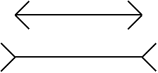

# Moral Illusions

The interesting thing about optical illusions is that one may be aware of the illustion, yet, it does not go away.

It seems that the lines on the picture have different lengths even though one positively knows that they are exactly the same.

Now consider this statement:

> Until January 2016, all nine situations which the International Criminal Court (ICC) had been investigating were in African countries. None were in European or Americal countries. ICC is therefore biased against Africa.

It doesn't take much thought to realize that a country with war criminals in jail is better off than a country with war criminals at large. So, if anything, the ICC is biased against Europe and America.

But knowing that doesn't make the moral illusion go away. Read the quotation again and it still feels like Africa is being wronged.

**May 6th, 2022**
