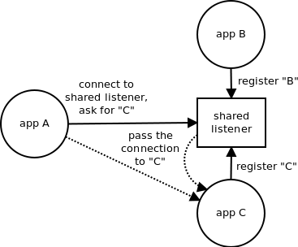

# Messaging & Multiplexing

**I've originally written this article in September 2011. Given that I've had several discussions about multiplexing inside of messaging solutions in past few days, I've decided to re-publish a slightly improved version.**

Introduction
============

Some messaging technologies (e.g. AMQP) allow for multiplexing several data streams on top of a single TCP connection. Distributed messaging systems such as ZeroMQ which assume lot of small independent services running on a single box or even inside a single process seem to make this kind of multiplexing even more desirable. The idea is to use only a single TCP connection to speak to all the services on the other side of the network. This article introduces the requirements for such a system, it describes the technology needed to provide it and discusses the advantages gained.

Rationale
=========

The most common use case for multiplexing is running several services within a single process. Think, for example, of a stock exchange gateway that provides market data service (publish/subscribe-style service that pushes the stock quote prices to the clients) as well as order processing service (request/reply style service allowing to place orders on the exchange). These are clearly distinct services, however, both are located in the same process. Wouldn't it be nice if the client could open a single connection to the gateway and multiplex both market data and orders on top of it instead of opening two independent TCP connections, one exclusively for the market data, the other one for the orders?

Intuitively, such a design feels especially appropriate in the cases where the connection stretches over the Internet. Somehow, single connection appears to be more parsimonious when compared to multiple parallel connections.

When users are asked about actual concerns that make them prefer single TCP connection over multiple connections, the following answers are the most common:

1.  Multiple TCP connections can cause excessive memory usage. Each TCP connection allocates a transmit and receive buffers (for example, Linux default is currently 128kB). If there are multiple connections involved the memory usage grows proportionally to their number.
2.  Opening multiple connections can cause excessive TCP handshaking and thus prolonged start-up time.
3.  Multiple TCP connections mean that common control packets (e.g. acknowledgements), are sent on each connection separately, instead of doing it in an aggregated manner on top of a single connection. That in turn increases the bandwidth usage.
4.  There's only one port open in the firewall. Even when there are multiple services to be accessed from beyond the firewall, they should all share the same TCP port.

Algorithm
=========

The main problem to solve when dealing with multiplexing on top of TCP is how to handle the pushback mechanism.

On the one hand, we have to avoid TCP pushback.

Imagine two receivers reading from the same TCP connection. If one of them (R2) is not reading the data — maybe because it's busy doing some other work at the moment — the data linger in the TCP receive buffer and block all the remaining data in the buffer, including the data that belong to the other receiver (R1). This way, one slow or stuck service blocks all the other services sharing the same TCP connection:

To prevent the blocking we need an asynchronous reader that would read the data from the TCP connection as fast as possible and then queue them into a separate buffer for each receiver:

While the above algorithm solves the problem of blocking it is prone to memory exhaustion. If the asynchronous reader reads the data from TCP buffer faster than the receivers are able to consume it the per-receiver buffers will gradually grow and eventually run out of memory.

To solve that problem we have to re-introduce pushback mechanism on a per-stream level.

Each per-receiver buffer should be of fixed size and the sender should never send more data than there is free space available in the buffer. Technically, this can be achieved by regularly advertising the amount of free space available in the queue (ACKs):

EDIT: While the algorithm above does implement multiplexing on top of TCP, it does not fully match — performance-wise — mutliplexing solutions built directly on top of IP. The reason is that with TCP one lost packet prevents delivery of subsequent packets, even though the latter may contain data from unrelated channels. Thus, we are getting transport-layer head of line blocking and thus higher latency on _all_ channels in the case of loss of a single packet. This restriction doesn't apply to low-level multiplexing solutions such as SCTP or QUIC.

Sanity Check
============

How does the above algorithm addresses the users' concerns?

1.  It was assumed that multiplexing would cut the memory usage by not requiring separate buffer for each multiplexed stream. It turns out that per-stream buffers are still needed. The only difference is that the buffers are allocated on top of TCP instead of within TCP. Thus, instead of having N TCP buffers (separate connections) we end up with 1 TCP buffer (single connections) and N buffers on top (multiple streams). Which actually means using even more memory.
2.  It was assumed that multiplexing could limit the amount of initial handshaking. This happens to be true if number of streams multiplexed is known in advance. The implementation can negotiate the number of streams and create the appropriate buffers once only (when TCP connection is established) instead of re-negotiating each time new stream is about to be used. However, in realistic scenarios the number of streams is often not known in advance. In such case we need a handshake to establish new buffer for the new stream. That means that in this respect there's no advantage over using multiple TCP connections.
3.  It was assumed that multiplexing could decrease the bandwidth usage by passing the control packets, such as ACKs, once only instead of passing them separately for each stream. However, it turns out that ACKs (advertisements of free space in the receive buffer) have to be passed on per-stream basis anyway. The only difference is that they are sent on top of TCP instead of using native TCP acknowledgements. We end up with using 1 TCP acknowledgement stream and N acknowledgement streams on top of TCP. Which actually makes bandwidth usage worse not better.

So far, the analysis have shown that multiplexing on top of TCP doesn't really solve the problems it was supposed to solve. It can even make them slightly worse.

What we are left with is the last concern, namely funnelling multiple streams through a single open port in the firewall. This concern deserves more investigation.

Sharing a Port
==============

Using the same port for multiple services is part of the arms race between the administrators and the developers. Administrators, worried about security, want to be in control of the network and thus allow only for specific applications (such as web browsers) to reach out of the corporate firewall. The developers, on the other hand, want the fastest possible deployment cycle and shortest possible time-to-market. Thus, they want to disguise their applications as being something else and utilise whatever ports happen to be open in the firewall (e.g. port 80) rather than negotiating opening a new port with the client's administrators.

The crucial observation here is that the term "port" in this context means "destination port". Destination ports are used to identify services (port 80 = HTTP) and do not, by themselves, uniquely identify particular TCP connection. TCP connection is uniquely identified by the combination of the destination port and the source port.

The above means that sharing the same destination port doesn't necessarily mean sharing the TCP connection. Two connections can use the same destination port but differ by the source port.

Technically, such sharing can be accomplished by introducing a special service to listen on the shared destination port and then to hand the incoming connections to the particular services as appropriate:

Other Considerations
====================

When using multiple TCP connections, each has to be go through its own "slow start" period. However, this is not a problem with long-lived connections which are the most common case in messaging middleware. It should be noted that using SCTP, with its channelling mechanism, would be more appropriate in this scenario than using TCP.

Multiple TCP connections occupy multiple slots in NAT table in case your box is behind a NAT.

Multiple TCP connections impacts the network fairness (multiple connections can get more bandwidth than a single one).

Also, using large amounts of connections is one of the constituents that add up to create the bufferbloat problem.

On the other hand, separate connections allow for targeted monitoring and tuning of the network. You can monitor a single stream instead of monitoring whole cluster of streams multiplexed over a single connection. You can also set the network to treat individual streams differently, say be specifying bandwidth quotas or setting the ToS bits.

Conclusion
==========

Multiplexing on top of TCP in overall fails to deliver the advantages it is assumed to provide. Moreover, implementing such multiplexer basically means implementing custom TCP on top of the standard TCP (rx buffers, ACKs etc.). Such implementation will almost necessarily be buggy, it will have sub-optimal performance and it will just duplicate the functionality already present in the network stack. Thus, we get a lot of drawbacks with no associated advantages.

The special case of multiplexing several services on the top of a single TCP port doesn't require actual multiplexing of the data. It can be achieved by passing separate TCP connections initiated on the same port to the different applications as appropriate.

**February 24th, 2013**