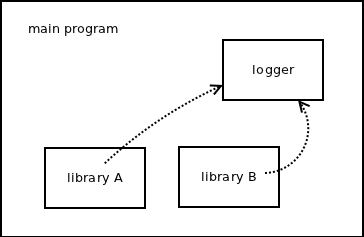
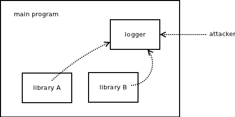

# Getting Rid of ZeroMQ-style Contexts

I've argued several times (see for example [here](http://www.aosabook.org/en/zeromq.html#fig.zeromq.multiuse)) that global state in a library should not be truly global, i.e. stored in C-style global variables, rather an instance of the "global" state should be created upon user request. The reason is that if the two modules within a process used the same low-level library, they would step on each other's toes:

Imagine the library C has a global variable foo and setfoo() and getfoo() functions to access it. Now imagine the following sequence of events:

1.  Library A: setfoo(10)
2.  Library B: setfoo(20)
3.  Library A: getfoo() — it expects 10 to be returned but gets 20 instead!

While the rule of thumb still holds for libraries in general — instead of having a single global state, let each module create its own state — I believe that application of the rule in ZeroMQ was a mistake. ZeroMQ is a **communication** library and, as such, it is an exception to the rule. Communication means sharing of data and thus, communication library's task is to make modules visible each to another, rather than separating them into impervious compartments.

Let's have a look at a concrete example. Imagine that the main program creates a logger object (a PULL socket that writes all received messages to the disk) and wants all the modules loaded into the process to report errors to the logger. As the communication happens within a single process, INPROC transport should be used to convey the log records from individual modules to the logger. However, according to the reasoning above, each module has it's own instance of global state (i.e. its own ZeroMQ context) and the INPROC transport in ZeroMQ doesn't allow for transferring messages between different contexts.

The problem could be solved by using IPC or TCP transport instead, however, that opens a security hole: What if attacker connected to the logger from outside and either posted false records or DoS'ed the system with a flood of log requests?

So, alternatively, the main program can create the ZeroMQ context and share it with individual modules. That would work as expected, however, there are several problems with the approach:

1.  To create a communication channel within a process you need to specify both context and address. Contrast that with all the remaining transports where specifying an address is sufficient to establish a communication.
2.  Context, unlike an address is a pointer to memory. It changes every time the process is restarted. You can't store it in a configuration file, in database, or similar.
3.  Sharing the context pointer between modules may be a problem when modules are written in different languages. Many high-level languages don't even have a native concept of pointer, instead they use ideosyncratic hacks to represent the pointer, such as storing it in an integer value, wrapping the pointer in the "native object" etc. There's no much chance that these representations of the context pointer would be compatible — and thus trasferrable — among any particular pair of languages.

Given the above, I believe that I've made a mistake by introducing contexts into ZeroMQ. Contexts are designed for strict separation between modules which is not a desirable feature in a communication library.

Thus, in [nanomsg](http://nanomsg.org) I've got rid of contexts. User creates sockets and that's it. You don't need to create a context beforehand.

At the same time INPROC addresses are visible within the process as a whole, rather than being restricted only to the local module/context. This way it is easy to create a communication channel between modules inside a process.

Additional benefit of the change is the simplification of the API. Compare the following two snippets of code. First one opens a connection a sends a message in ZeroMQ:

    void *ctx = zmq_ctx_new ();
    void *s = zmq_socket (ctx, ZMQ_PUSH);
    zmq_connect (s, "tcp://192.168.0.111:5555");
    zmq_send (s, "ABC", 3, 0);
    zmq_close (s);
    zmq_ctx_destroy (ctx);

And here's the same code for nanomsg:

    int s = nn_socket (AF_SP, NN_PUSH);
    nn_connect (s, "tcp://192.168.0.111:5555");
    nn_send (s, "ABC", 3, 0);
    nn_close (s);

Of course, removing the contexts has some repercussions on the semantics of the system. For example, nn\_close() becomes a blocking function. It may wait for "linger" period to send any pending outbound data before closing the socket. In ZeroMQ, zmq\_close() is completed immediately and waiting is postponed to zmq\_ctx\_destroy() function which, given the removal of contexts, has no equivalent in nanomsg.

While that may be considered a drawback in some ways, in other ways it is a desirable behaviour. For example, after socket is closed, the system resources allocated by the socket — such as TCP port or IPC file — are guaranteed to be released and thus ready to be re-used. However, that's a topic for another blog post.

**May 14th, 2013**