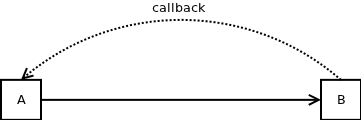
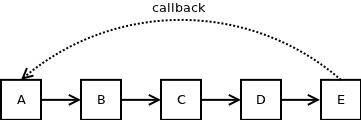
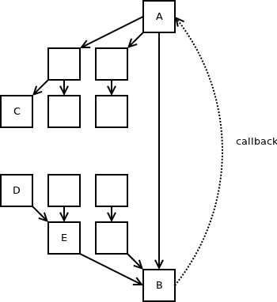
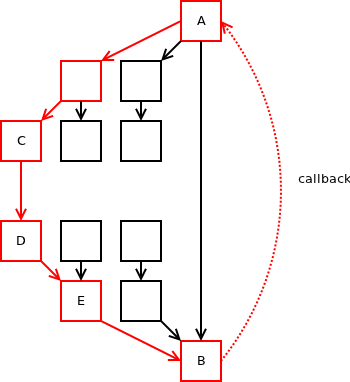

# The Callback Hell

I've spent last month re-writing the code of [nanomsg](http://nanomsg.org) to use state machines internally, passing asynchronous events around instead of using random callbacks between the components. The change is complex, requires a lot of work and it is not visible to the end user, so the question is: Why do it at all? The time can be put to better use implementing sexy new features that would make the users happy. Instead, the progress on the library seems stalled and such major re-write may even result in regressions. Why even bother then?

I'll try to provide the answer in this article. It will introduce a generic argument against callbacks, so if you are using callbacks, give it a read even if you are not interested in nanomsg per se. By the way, note that I am not going to say anything new here. The knowledge has been around for literally decades. However, given the amount of callback-driven programming that's being done and apparent — although completely incomprehensible to me — craving of some users of ZeroMQ and nanomsg for callback-based APIs, I believe that re-iterating the basics would be useful.

The problem is that ZeroMQ codebase evolved to the point where the internal interactions within the library are so complex that adding any new core functionality have become virtually impossible. For example, while the library exists for 6 years there was no new transport mechanism added during that time. There were many attempts, but none have succeeded to provide a fully stable code that could be merged back to the mainline. Instead, people resort to writing bridges between ZeroMQ and other transports.

One of the goals of nanomsg was to improve the internal architecture of the library in such a way that adding new functionality would be easy. In the first iteration I've tried to avoid state machines once again (in some future article I'll try to explain why) and I've failed. The complexity have gradually crept back. It seems that the only way to keep the complexity at bay is to avoid callbacks.

Consider this code:

    struct A
    {
        void foo () {b->baz ();}
        void bar () {++i;}
        B *b;
        int i;
    }
    
    struct B
    {
        void baz () {a->bar ();}
        A *a;
    };

It's pretty simple. A has pointer to B and vice versa. If you invoke A::foo, it will invoke B::baz which in turn will invoke A::bar. A::bar increments a member variable of A. There's no catch there. The program will work as expected.

However, imagine we'll make A::foo a little bit more complex:

    void A::foo ()
    {
        int tmp = i;
        b->baz ();
        assert (tmp == i);
    }

We copy a class member variable into a local variable and invoke a function. Nothing wrong with that. However, right afterwards we'll do a sanity check and test whether the local variable still equals to the member variable. Surprisingly, it does not. The value of the member variable have mysteriously changed just because we've invoked method of a different object.

Of course, it's easy to spot what went wrong in this example. We can fix the problem in a simple way. For example, we can re-read the value of the member variable into the local variable after the call:

    void A::foo ()
    {
        int tmp = i;
        b->baz ();
        tmp = i;
        assert (tmp == i);
    }

Now the program works as expected. It looks like those pesky callbacks are not that hard to handle after all!

Well, not quite. In what follows I'll try to explain why the code above is a tarpit just waiting to eat you alive.

First, imagine the callback happens in a more complex setup. Object A calls object B, which calls object C, which calls object D, which calls object E, which in turn calls back to object A.

It's pretty obvious that handling the callback is going to be much more complex in this case. The problem stems from the fact that when A invokes B, it has no idea that there, nested five levels deep, is a call back to A. Thus, when the call to B returns, the developer will be genuinely surprised that the state of A have mutated in the meantime.

If there was only a single call in each function, as shown on the picture above, i.e. call to B would be the only function invocation in A, call to C would be the only function invocation in B etc. spotting the cycle would be still possible. However, let's suppose that each function contains in average three function invocations. That means that down there, five levels deep, are 243 functions one of which may — or may not — be a call back to A. That kind of thing is extremely hard to spot just by looking at the code.

Furthermore, many of the functions in the call graph are invoked only when certain condition is met and some of those conditions are pretty rare. If the path from A back to A contains several rare conditions, the probabilities get multiplied and the callback will almost never happen. Thus, even with extensive testing it is entirely possible that the callback will never be triggered and the problem it causes will go through the testing unnoticed — only to occur in production, presumably at the worst possible moment.

Add to that that the callback cycles are often not 5, but 10 or 15 steps long. In such environment there is basically no way to make sure that the program will behave decently. The best thing you can do is to perform some testing, then ship the product, then fix the bugs reported by the users. Even then you can be pretty sure there are some very rare bugs still lurking in the codebase.

I am going to suppose that by now I've persuaded you that long cycles in the call graph are a really bad idea. So let's get back to our original example. A calls B which in turn calls back to A. It's the simplest possible case of callback. The cycle is immediately visible, the developer can carefuly tune it to work in all circumstances. He can document the cycle and put big WARNING comment before each function invocation so that no future maintainer of the codebase can accidentally overlook it. What can possibly go wrong?

The problem is that in any realistic scenario the call graph is much more complex that the simple two-node graph as shown at the top of this article. There are other functions called by A and B gets called from other functions as well:

Now imagine that at some point in the future some random developer adds a call from C to D. He's not even aware of existence of A and B, let alone the cycle between them. However, the change introduces a new 6-node-long cycle:

Suddenly, it may happen that component E makes call to B — which worked with no problems before — and finds its own state modified when the function returns. Which, of course, makes it fail, or, even worse, misbehave.

To understand the scale of the problem we've created consider this: Developer of C have made a local change to C. The change have interacted with the small cycle in a completely unrelated subsystem and created a big cycle, which in turn causes yet enother completely unrelated component (E) to fail. Now let's assume that developer of C, developer of A&B and developer of E are three different people, maybe even working in different departments or — if 3rd party libraries are used — in different companies. Perfectly reasonable change done by the first developer interacts in a bad way with a code written 15 years ago by the second developer and results in bug reported to the third developer working for a different company in some distant country and not even speaking English. I would rather not be that in that guy's shoes.

The common way to deal with the problems caused by cycles in the call graph is to introduce a new class variable ("executing") that is turned on when the object is already being used and turned off when it is not. By checking this variable the component can identify the case where there is a cycle on the call stack and handle the case appropriately.

What follows is a simple example of such code. _executing_ and _i_ are member variables of class _A_. If the function is called in cycle it does nothing. If there's no cycle it increments the variable _i_:

    void A::foo ()
    {
        if (executing)
            return;
        executing = true;
        ++i;
        executing = false;
    }

This approach can help to get rid of a particular bug, but it's a hacky solution that may cause even more troubles in the future. Imagine that the code is modified like this:

    void A::foo ()
    {
        if (executing) {
            delete this;
            return;
        }
        executing = true;
        b->bar ();
        executing = false;
    }
    
    void B::bar ()
    {
        a->foo ();
    }

Can you spot the problem?

The program will fail trying to access invalid memory location when doing _executing=false_. We can't really touch the member because the object can change while we do the _b->bar()_ call and the "change" can actually mean that it gets deallocated.

The only real solution here is to delay the callback. To simply make a note that it has to be executed and execute it later on when call to _A::foo()_ exits. And that, of course, is the first step towards a full-blown state machine approach.

If you are interested in the topic, there's a lot of literature about state machines on the web as well as lot of tools that will help you with implementing them. I would also like to explore this matter further in this blog. Specifically, there are two questions I am interested in: First, why are the developers willing to jump through the hoops just to avoid using state machines? Second, are there any good rules of thumb (as opposed to actual software tools) that the developer should keep in mind when implementing a state machine?

Stay tuned.

**May 28th, 2013**
